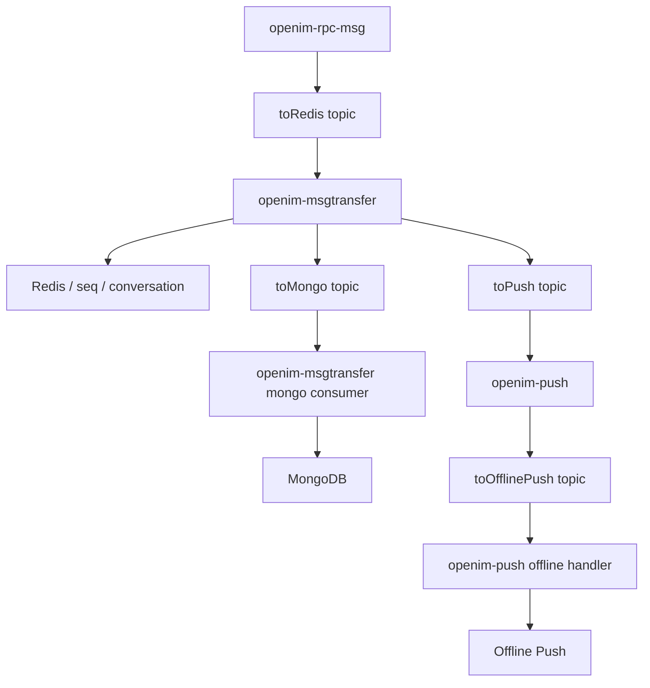
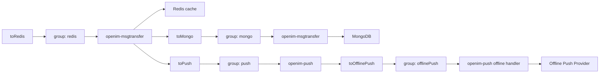
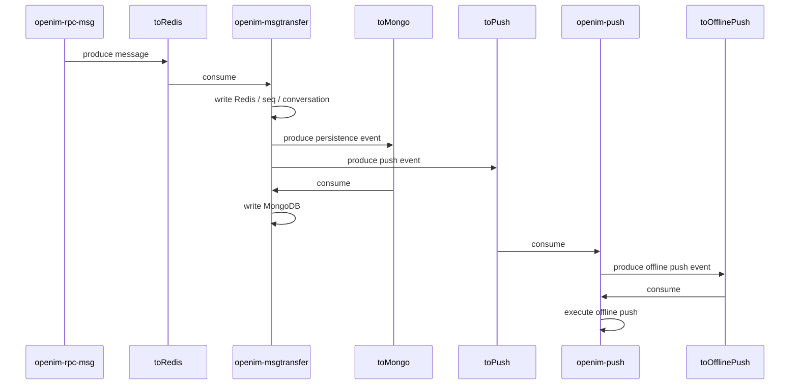

# Kafka 消息转发路径检查

可以，已经查完了。当前主机上的 Kafka 容器、topic、consumer group，以及 OpenIM 代码中的生产/消费关系都能对上，消息转发路径比较清晰。

## 先说结论

当前 Kafka 的 OpenIM 消息链路是这条主路径：

```text
openim-rpc-msg
-> topic: toRedis
-> openim-msgtransfer 消费
-> 写 Redis / 更新 seq / 创建会话
-> 再分发到:
   -> topic: toMongo
   -> topic: toPush
-> openim-msgtransfer 再消费 toMongo
-> 写 MongoDB
-> openim-push 消费 toPush
-> 按需转发到:
   -> topic: toOfflinePush
-> openim-push 再消费 toOfflinePush
-> 执行离线推送
```

也就是：

```text
发送消息
-> Redis链路
-> Mongo持久化链路
-> Push链路
-> OfflinePush链路
```

## Mermaid 流程图

### 总览图



### 分 topic 树状图



### 简化时序图



## 你这台机器上 Kafka 的实际运行状态

当前运行中的 Kafka 容器是：

- 容器名：`kafka`
- 镜像：`bitnamilegacy/kafka:3.5.1`

我实际查到的 topic 有：

- `toRedis`
- `toMongo`
- `toPush`
- `toOfflinePush`

对应的 consumer group 有：

- `redis`
- `mongo`
- `push`
- `offlinePush`

这些与 OpenIM 配置完全一致。

## Kafka 当前 broker 配置

来自容器环境和 `docker-compose.yml`：

- 内部监听：`kafka:9092`
- 控制器：`kafka:9093`
- 宿主机外部访问：`localhost:19094`

关键配置：

- `KAFKA_NUM_PARTITIONS=8`
- `KAFKA_CFG_AUTO_CREATE_TOPICS_ENABLE=true`
- `KAFKA_CFG_ADVERTISED_LISTENERS=INTERNAL://kafka:9092,EXTERNAL://localhost:19094`

对应文档和配置：

- `/u03/github/open-im-server/docker-compose.yml:172-239`
- `/u03/github/open-im-server/config/kafka.yml:1-26`

## Kafka topic 与 group 的配置来源

`/u03/github/open-im-server/config/kafka.yml`

明确写了：

- `toRedisTopic: toRedis`
- `toMongoTopic: toMongo`
- `toPushTopic: toPush`
- `toOfflinePushTopic: toOfflinePush`

以及：

- `toRedisGroupID: redis`
- `toMongoGroupID: mongo`
- `toPushGroupID: push`
- `toOfflinePushGroupID: offlinePush`

这和 Kafka 运行时查到的实际结果一致。

## 代码里怎么把 topic 和 consumer group 绑定起来的

`/u03/github/open-im-server/pkg/mqbuild/builder.go:22-30`

这里把 topic 和 group 做了固定映射：

- `toRedis` -> `redis`
- `toMongo` -> `mongo`
- `toPush` -> `push`
- `toOfflinePush` -> `offlinePush`

并且：

- `GetTopicProducer()` 按 topic 创建 producer
- `GetTopicConsumer()` 按 topic 找到对应 group，然后创建 consumer

所以这个映射不是推测，是代码里写死的。

## 核心消息转发路径，按代码还原

### 1. 第一跳：`openim-rpc-msg` 生产到 `toRedis`

代码位置：

- `/u03/github/open-im-server/internal/rpc/msg/server.go:82-139`

这里在 `msg` 服务启动时：

- 创建了 `redisProducer`
- 使用的是 `config.KafkaConfig.ToRedisTopic`

也就是：

```text
openim-rpc-msg -> producer(toRedis)
```

这说明消息进入 Kafka 的第一站是 `toRedis`。

### 2. 第二跳：`openim-msgtransfer` 消费 `toRedis`

代码位置：

- `/u03/github/open-im-server/internal/msgtransfer/init.go:37-45`
- `/u03/github/open-im-server/internal/msgtransfer/init.go:89-137`
- `/u03/github/open-im-server/internal/msgtransfer/init.go:149-185`

这里非常关键，注释直接写明了：

- `historyConsumer` 订阅 `toRedis`
- 消息先存到 Redis
- 然后发到 `toPush`
- 再发到 `toMongo`

原文含义就是：

```text
toRedis
-> 存 Redis
-> 发 toPush
-> 发 toMongo
```

这是你要的“消息转发路径”最核心的一段。

### 3. `toRedis` 消费后的具体处理内容

代码位置：

- `/u03/github/open-im-server/internal/msgtransfer/online_history_msg_handler.go:254-328`
- `/u03/github/open-im-server/internal/msgtransfer/online_history_msg_handler.go:331-352`
- `/u03/github/open-im-server/internal/msgtransfer/online_history_msg_handler.go:376-382`

具体流程是：

1. `handleMsg()` 先处理非存储消息，直接推到 `toPush`
2. 对需要存储的消息：
   - `BatchInsertChat2Cache(...)`
   - 更新已读 seq
   - 必要时创建 conversation
   - `MsgToMongoMQ(...)` 发到 `toMongo`
   - `toPushTopic(...)` 发到 `toPush`

也就是说，`toRedis` 的消费者并不只是“写一下 Redis”，而是承担了“消息聚合后的总分发器”角色。

可以理解成：

```text
toRedis
-> msgtransfer
   -> Redis缓存/seq
   -> Conversation创建
   -> toMongo
   -> toPush
```

### 4. 第三跳：`openim-msgtransfer` 再消费 `toMongo`，写 MongoDB

代码位置：

- `/u03/github/open-im-server/internal/msgtransfer/init.go:125-145`
- `/u03/github/open-im-server/internal/msgtransfer/init.go:163-174`

这里：

- `historyMongoConsumer` 订阅 `toMongo`
- 回调 `HandleChatWs2Mongo`

也就是：

```text
toMongo
-> msgtransfer consumer(group mongo)
-> 写 MongoDB
```

所以 `toMongo` 这条链路就是“持久化链路”。

### 5. 第四跳：`openim-push` 消费 `toPush`

代码位置：

- `/u03/github/open-im-server/internal/push/push.go:78-100`
- `/u03/github/open-im-server/internal/push/push.go:108-122`

这里：

- `pushConsumer` 订阅 `toPush`
- `pushHandler.HandleMs2PsChat(...)` 处理推送逻辑

所以：

```text
toPush
-> openim-push consumer(group push)
-> push handler
```

### 6. 第五跳：`openim-push` 生产/消费 `toOfflinePush`

代码位置：

- `/u03/github/open-im-server/internal/push/push.go:80`
- `/u03/github/open-im-server/internal/push/push.go:90`
- `/u03/github/open-im-server/internal/push/push.go:124-137`

这里能看到：

- `offlinePushProducer` 生产到 `toOfflinePush`
- `offlinePushConsumer` 消费 `toOfflinePush`

也就是：

```text
toPush
-> openim-push
-> toOfflinePush
-> openim-push offline handler
-> 具体离线推送执行
```

这说明 `push` 服务本身内部还分了两段：

1. 一段处理普通 push 消息
2. 一段处理离线 push 任务

## 用树状结构把 Kafka 转发路径列出来

```text
Kafka Message Flow
├─ toRedis
│  ├─ Producer: openim-rpc-msg
│  └─ Consumer Group: redis
│     └─ Consumer Service: openim-msgtransfer
│        ├─ 写 Redis 缓存
│        ├─ 更新 seq / 已读状态
│        ├─ 创建 conversation
│        ├─ 转发到 toMongo
│        └─ 转发到 toPush
├─ toMongo
│  ├─ Producer: openim-msgtransfer
│  └─ Consumer Group: mongo
│     └─ Consumer Service: openim-msgtransfer
│        └─ 写 MongoDB
├─ toPush
│  ├─ Producer: openim-msgtransfer
│  └─ Consumer Group: push
│     └─ Consumer Service: openim-push
│        ├─ 处理推送逻辑
│        └─ 按需转发到 toOfflinePush
└─ toOfflinePush
   ├─ Producer: openim-push
   └─ Consumer Group: offlinePush
      └─ Consumer Service: openim-push
         └─ 执行离线推送
```

## 运行时观测结果也支持这个路径

我查到的 Kafka topic 描述：

- 四个业务 topic 都存在
- 每个 topic 都是 `8` 个分区
- 每个 consumer group 都已经绑定到对应 topic 的各分区

说明这些消费者都实际在线，不是只有配置没有运行。

例如：

- `redis` group 在消费 `toRedis`
- `mongo` group 在消费 `toMongo`
- `push` group 在消费 `toPush`
- `offlinePush` group 在消费 `toOfflinePush`

从 consumer host 看，消费者都来自 Docker 网络里的服务实例。

## 当前消息量情况

从 offset 看，目前消息量很少，基本接近空：

- `toRedis` 只有分区 7 出现过 `1` 条记录
- `toPush` 也只有分区 7 的 `LOG-END-OFFSET` 为 `1`
- `toMongo` 和 `toOfflinePush` 目前看起来没有明显积压

这意味着：

1. 这套链路已经创建并在线
2. 当前没有显著 backlog
3. 机器上最近只有极少量消息流过

## 一个值得注意的小点

consumer group 描述里不少分区显示：

- `CURRENT-OFFSET = -`
- `LOG-END-OFFSET = 0`

这不代表异常，只代表该分区还没有真正消费过有效消息，或者 topic 中本来就没数据。

因为当前 Kafka 几乎是空载状态，所以这很正常。

## 一句话总结这台机器的 Kafka 消息转发路径

当前主机上的 OpenIM Kafka 链路是：

```text
msg服务写 toRedis
-> msgtransfer 消费并写 Redis
-> msgtransfer 再分流到 toMongo 和 toPush
-> msgtransfer 写 Mongo
-> push 服务消费 toPush
-> push 服务再写/读 toOfflinePush
-> 完成离线推送
```

## 后续可继续检查的方向

1. 直接检查当前有哪些 `openim-msgtransfer`、`openim-push`、`openim-rpc-msg` 进程或容器在跑
2. 实际抓一条 Kafka 消息样本，看 `toRedis -> toPush/toMongo` 的消息内容结构是什么样

## 命令复现附录

下面这些命令就是这次检查 Kafka 消息路径时实际可复用的命令，你后续可以直接在当前主机复查。

### 1. 查看当前运行中的 Docker 容器

```bash
docker ps --format '{{.ID}}\t{{.Image}}\t{{.Names}}\t{{.Ports}}'
```

### 2. 查看 Kafka 容器环境变量

```bash
docker inspect kafka --format '{{json .Config.Env}}'
```

### 3. 查看 Kafka 中存在的 topic

```bash
docker exec kafka /opt/bitnami/kafka/bin/kafka-topics.sh --bootstrap-server localhost:9092 --list
```

### 4. 查看 Kafka 全部 topic 详情

```bash
docker exec kafka /opt/bitnami/kafka/bin/kafka-topics.sh --bootstrap-server localhost:9092 --describe
```

### 5. 查看全部 consumer group

```bash
docker exec kafka /opt/bitnami/kafka/bin/kafka-consumer-groups.sh --bootstrap-server localhost:9092 --list
```

### 6. 查看 `redis` 组消费情况

```bash
docker exec kafka /opt/bitnami/kafka/bin/kafka-consumer-groups.sh --bootstrap-server localhost:9092 --describe --group redis
```

### 7. 查看 `mongo` 组消费情况

```bash
docker exec kafka /opt/bitnami/kafka/bin/kafka-consumer-groups.sh --bootstrap-server localhost:9092 --describe --group mongo
```

### 8. 查看 `push` 组消费情况

```bash
docker exec kafka /opt/bitnami/kafka/bin/kafka-consumer-groups.sh --bootstrap-server localhost:9092 --describe --group push
```

### 9. 查看 `offlinePush` 组消费情况

```bash
docker exec kafka /opt/bitnami/kafka/bin/kafka-consumer-groups.sh --bootstrap-server localhost:9092 --describe --group offlinePush
```

### 10. 在代码中搜索 Kafka topic 和 group 配置

```bash
rg -n "ToRedisTopic|ToMongoTopic|ToPushTopic|ToOfflinePushTopic|ToRedisGroupID|ToMongoGroupID|ToPushGroupID|ToOfflinePushGroupID" /u03/github/open-im-server
```

### 11. 在代码中搜索 producer / consumer 绑定点

```bash
rg -n "GetTopicProducer\(|GetTopicConsumer\(" /u03/github/open-im-server
```

### 12. 快速定位消息转发关键文件

```bash
rg -n "toRedis|toMongo|toPush|toOfflinePush" /u03/github/open-im-server
```

### 13. 重点文件

- `/u03/github/open-im-server/config/kafka.yml`
- `/u03/github/open-im-server/pkg/mqbuild/builder.go`
- `/u03/github/open-im-server/internal/rpc/msg/server.go`
- `/u03/github/open-im-server/internal/msgtransfer/init.go`
- `/u03/github/open-im-server/internal/msgtransfer/online_history_msg_handler.go`
- `/u03/github/open-im-server/internal/push/push.go`
- `/u03/github/open-im-server/docker-compose.yml`

## 故障排查手册

下面按“现象 -> 可能断点 -> 应查什么”的方式整理，适合直接用于运行中的 OpenIM Kafka 链路排障。

### 场景 1：消息发出后，`toRedis` 没有任何数据

可能断点：

- `openim-rpc-msg` 没有正常生产消息到 Kafka
- `msg` 服务没有连上 Kafka
- 发送消息流程本身没有走到 MQ 生产阶段

优先检查：

1. Kafka topic 是否存在
2. `openim-rpc-msg` 服务是否在运行
3. `config/kafka.yml` 中 broker 地址是否正确
4. `internal/rpc/msg/server.go` 中 `ToRedisTopic` 是否被成功初始化

重点代码：

- `/u03/github/open-im-server/internal/rpc/msg/server.go:82-85`
- `/u03/github/open-im-server/config/kafka.yml:10-24`

推荐命令：

```bash
docker exec kafka /opt/bitnami/kafka/bin/kafka-topics.sh --bootstrap-server localhost:9092 --list
docker exec kafka /opt/bitnami/kafka/bin/kafka-consumer-groups.sh --bootstrap-server localhost:9092 --describe --group redis
```

### 场景 2：`toRedis` 有数据，但 Redis 没更新、会话没创建

可能断点：

- `openim-msgtransfer` 没有消费 `toRedis`
- `HandlerRedisMessage` 或批处理流程异常
- `BatchInsertChat2Cache` 执行失败
- 关联的 group / conversation RPC 调用异常

优先检查：

1. `redis` consumer group 是否在线
2. `openim-msgtransfer` 是否在运行
3. 是否出现 `historyConsumer err`
4. 是否出现 `batch data insert to redis err`
5. 是否出现 group member 或 conversation 创建相关错误

重点代码：

- `/u03/github/open-im-server/internal/msgtransfer/init.go:149-159`
- `/u03/github/open-im-server/internal/msgtransfer/online_history_msg_handler.go:254-328`

关键日志关键词：

- `historyConsumer err`
- `batch data insert to redis err`
- `single chat or notification first create conversation error`
- `get group member ids error`

### 场景 3：消息进了 `toRedis`，但没进 `toMongo`

可能断点：

- `MsgToMongoMQ` 生产失败
- `storageList` 分类后为空
- `msgtransfer` 只完成了 Redis 分支，没成功写入 Mongo topic

优先检查：

1. `toMongo` topic 的 `LOG-END-OFFSET` 是否增长
2. `mongo` consumer group 是否在线
3. 是否出现 `Msg To MongoDB MQ error`
4. 是否出现 `MsgToMongoMQ` 相关错误日志

重点代码：

- `/u03/github/open-im-server/internal/msgtransfer/online_history_msg_handler.go:318-324`
- `/u03/github/open-im-server/pkg/common/storage/controller/msg_transfer.go`

关键日志关键词：

- `Msg To MongoDB MQ error`
- `MsgToMongoMQ`

### 场景 4：`toMongo` 有数据，但 MongoDB 没落库

可能断点：

- `openim-msgtransfer` 的 mongo consumer 没跑
- `HandleChatWs2Mongo` 内部写库失败
- MongoDB 连接或模型初始化失败

优先检查：

1. `mongo` consumer group 是否在线
2. `openim-msgtransfer` 是否存在 mongo consumer 订阅
3. MongoDB 是否可连接
4. `historyMongoConsumer err` 是否出现

重点代码：

- `/u03/github/open-im-server/internal/msgtransfer/init.go:163-174`
- `/u03/github/open-im-server/internal/msgtransfer/online_msg_to_mongo_handler.go`

关键日志关键词：

- `historyMongoConsumer err`

### 场景 5：`toPush` 有数据，但在线消息推送异常

可能断点：

- `openim-push` 没消费 `toPush`
- `HandleMs2PsChat` 解码失败
- 在线用户状态判断异常
- 网关在线推送失败

优先检查：

1. `push` consumer group 是否在线
2. `openim-push` 是否在运行
3. 是否出现 `push Unmarshal msg err`
4. 是否出现 `push failed`
5. 在线状态缓存是否正常

重点代码：

- `/u03/github/open-im-server/internal/push/push.go:108-122`
- `/u03/github/open-im-server/internal/push/push_handler.go:88-119`
- `/u03/github/open-im-server/internal/push/push_handler.go:195-218`

关键日志关键词：

- `push Unmarshal msg err`
- `push failed`
- `GetConnsAndOnlinePush online cache`

### 场景 6：在线消息正常，但没有离线推送

可能断点：

- 消息本身没开启 offline push
- 接收方被判定为在线，未进入 offline push 分支
- `toOfflinePush` 未生产成功
- `offlinePush` consumer 没消费
- 第三方离线推送执行失败

优先检查：

1. 消息 `Options` 中是否允许离线推送
2. `toOfflinePush` topic offset 是否增长
3. `offlinePush` group 是否在线
4. 是否出现 `offline push failed`
5. 是否出现 `message is push to offlinePush topic`

重点代码：

- `/u03/github/open-im-server/internal/push/push_handler.go:145-178`
- `/u03/github/open-im-server/internal/push/push_handler.go:246-260`
- `/u03/github/open-im-server/internal/push/offlinepush_handler.go:28-46`
- `/u03/github/open-im-server/pkg/common/storage/controller/push.go`

关键日志关键词：

- `message is push to offlinePush topic`
- `offline push failed`
- `receive to OfflinePush MQ`

### 场景 7：consumer lag 持续增长

可能断点：

- 某个 consumer 进程挂了
- 某个 consumer 在反复报错、无法提交 offset
- 下游 Redis / MongoDB / Push 服务变慢
- topic 分区数与消费实例数不匹配导致吞吐受限

优先检查：

1. `redis` / `mongo` / `push` / `offlinePush` 四个 group 的 lag
2. 对应服务实例数是否在线
3. Redis / MongoDB / 推送服务是否有明显错误
4. Kafka topic 分区数是否合理

推荐命令：

```bash
docker exec kafka /opt/bitnami/kafka/bin/kafka-consumer-groups.sh --bootstrap-server localhost:9092 --describe --group redis
docker exec kafka /opt/bitnami/kafka/bin/kafka-consumer-groups.sh --bootstrap-server localhost:9092 --describe --group mongo
docker exec kafka /opt/bitnami/kafka/bin/kafka-consumer-groups.sh --bootstrap-server localhost:9092 --describe --group push
docker exec kafka /opt/bitnami/kafka/bin/kafka-consumer-groups.sh --bootstrap-server localhost:9092 --describe --group offlinePush
```

判断方式：

- 如果 `LOG-END-OFFSET` 不断增长，而 `CURRENT-OFFSET` 不跟进，就是消费落后
- 如果单个 group 全部分区都没人接管，优先看服务是否挂了
- 如果只有个别分区 lag 高，优先看分区热点或消费者处理异常

### 场景 8：topic 和 group 都存在，但消息链路偶发中断

可能断点：

- 网络抖动
- Kafka broker advertised listeners 配置不一致
- 容器外和容器内使用了不同地址，部分服务连错端口

你这台机器当前配置是：

- 容器内建议走 `kafka:9092`
- 宿主机外建议走 `localhost:19094`

重点配置：

- `/u03/github/open-im-server/docker-compose.yml:204-214`
- `/u03/github/open-im-server/config/kafka.yml:10`

如果 OpenIM 服务运行在 Docker 网络里，通常应优先核对是否错误地使用了宿主机地址。

## 最短排障路径

如果你只想最快定位问题，建议按下面顺序查：

1. 看 topic 有没有数据
2. 看对应 consumer group 有没有在线、有没有 lag
3. 看对应服务是否在跑
4. 看对应代码路径的关键错误日志
5. 看 Redis / MongoDB / Push 下游是否可用

压缩成一句话就是：

```text
先看 Kafka 是否进消息
再看 consumer 是否吃消息
最后看下游 Redis / MongoDB / Push 是否处理成功
```

## 排障决策树

下面这棵树适合值班时直接照着走，不需要先通读所有章节。

```text
消息异常
├─ A. 发送后 Kafka 没有任何变化
│  ├─ 查 topic 是否存在
│  ├─ 查 openim-rpc-msg 是否运行
│  ├─ 查 kafka.yml 地址是否正确
│  └─ 查 msg 服务是否成功创建 toRedis producer
├─ B. toRedis 有数据，但 redis group 不消费
│  ├─ 查 redis consumer group 是否在线
│  ├─ 查 openim-msgtransfer 是否运行
│  ├─ 查 historyConsumer err
│  └─ 查 batch data insert to redis err
├─ C. Redis 更新了，但 toMongo 没增长
│  ├─ 查 MsgToMongoMQ 是否报错
│  ├─ 查 toMongo topic offset
│  └─ 查消息是否被分类为 storageList
├─ D. toMongo 有数据，但 MongoDB 没落库
│  ├─ 查 mongo consumer group 是否在线
│  ├─ 查 historyMongoConsumer err
│  └─ 查 MongoDB 连通性
├─ E. toPush 有数据，但在线推送失败
│  ├─ 查 push consumer group 是否在线
│  ├─ 查 push Unmarshal msg err
│  ├─ 查 push failed
│  └─ 查在线状态缓存与网关推送
├─ F. 在线推送正常，但没有离线推送
│  ├─ 查消息 Options 是否允许 offline push
│  ├─ 查 toOfflinePush 是否增长
│  ├─ 查 offlinePush group 是否在线
│  ├─ 查 message is push to offlinePush topic
│  └─ 查 offline push failed
└─ G. lag 持续增长
   ├─ 查对应 consumer 是否在线
   ├─ 查分区是否有热点
   ├─ 查下游 Redis/Mongo/Push 是否变慢
   └─ 查 Kafka 分区数与实例数是否匹配
```

## 日志关键词速查表

| 日志关键词 | 常见含义 | 优先检查方向 |
|---|---|---|
| `historyConsumer err` | `toRedis` 消费异常 | `openim-msgtransfer`、Kafka 连接、redis group |
| `batch data insert to redis err` | 消息写 Redis 缓存失败 | Redis、msgtransfer、消息分类 |
| `Msg To MongoDB MQ error` | 从 msgtransfer 发往 `toMongo` 失败 | Kafka producer、toMongo topic |
| `MsgToMongoMQ` | Mongo 持久化分支相关错误 | Kafka、msgtransfer、toMongo |
| `historyMongoConsumer err` | `toMongo` 消费异常 | mongo group、msgtransfer、MongoDB |
| `MsgToPushMQ` | 从 msgtransfer 发往 `toPush` 失败 | Kafka producer、toPush topic |
| `push Unmarshal msg err` | `openim-push` 无法解析 `toPush` 消息 | 消息格式、pb 编解码 |
| `push failed` | 在线推送执行失败 | 在线用户判断、网关推送、msggateway |
| `GetConnsAndOnlinePush online cache` | 在线推送阶段的在线状态判断日志 | 在线缓存、用户在线状态 |
| `message is push to offlinePush topic` | 向 `toOfflinePush` 生产失败 | Kafka producer、offlinePush topic |
| `receive to OfflinePush MQ` | 离线推送消费者已收到消息 | offlinePush consumer 正常 |
| `offline push failed` | 离线推送执行失败 | 第三方推送、token、推送服务配置 |
| `offline push Unmarshal msg err` | 离线推送消息解码失败 | pb 编解码、消息格式 |

## 标准检查清单

适合值班或复盘时逐项确认。

### 一、Kafka 基础状态

- [ ] Kafka 容器在运行
- [ ] `toRedis` topic 存在
- [ ] `toMongo` topic 存在
- [ ] `toPush` topic 存在
- [ ] `toOfflinePush` topic 存在
- [ ] topic 分区数符合预期

### 二、Consumer Group 状态

- [ ] `redis` group 在线
- [ ] `mongo` group 在线
- [ ] `push` group 在线
- [ ] `offlinePush` group 在线
- [ ] 没有异常增长的 lag

### 三、服务实例状态

- [ ] `openim-rpc-msg` 正在运行
- [ ] `openim-msgtransfer` 正在运行
- [ ] `openim-push` 正在运行
- [ ] Redis 可连接
- [ ] MongoDB 可连接

### 四、链路转发状态

- [ ] 发送消息后 `toRedis` offset 增长
- [ ] Redis 缓存或 seq 有变化
- [ ] `toMongo` offset 增长
- [ ] MongoDB 中有对应消息落库
- [ ] `toPush` offset 增长
- [ ] 在线用户能收到消息
- [ ] 需要离线推送时 `toOfflinePush` offset 增长
- [ ] 离线设备收到推送

### 五、日志状态

- [ ] 无 `historyConsumer err`
- [ ] 无 `historyMongoConsumer err`
- [ ] 无 `batch data insert to redis err`
- [ ] 无 `Msg To MongoDB MQ error`
- [ ] 无 `push Unmarshal msg err`
- [ ] 无 `push failed`
- [ ] 无 `offline push failed`

## 值班建议

如果线上发生“消息丢失”类报警，建议按下面顺序处理：

1. 先确定消息有没有进入 `toRedis`
2. 再确认 `redis` group 是否在消费
3. 然后确认 `toMongo` 和 `toPush` 是否被成功分流
4. 如果在线消息正常但离线异常，再单查 `toOfflinePush`
5. 最后再深入看 Redis、MongoDB、第三方推送服务

这样可以避免一开始就钻进业务代码，先用 Kafka 视角把断点迅速缩小。

## 实际日志抓取命令

当前这台主机上我只看到基础依赖容器在运行：`kafka`、`mongo`、`redis`、`etcd`、`minio`、`openim-web-front`，暂时没有看到 `openim-msgtransfer`、`openim-push`、`openim-rpc-msg` 这些服务容器。

这意味着两种可能：

1. OpenIM 服务当前没启动
2. OpenIM 服务不是以 Docker 容器方式运行，而是以本地进程方式运行

因此日志抓取建议分成两类。

### 一、如果服务跑在 Docker 容器里

先列出容器名：

```bash
docker ps --format '{{.Names}}'
```

如果你找到了类似下面的容器名：

- `openim-msgtransfer`
- `openim-push`
- `openim-rpc-msg`

可以直接抓日志：

```bash
docker logs --tail 200 openim-msgtransfer
docker logs --tail 200 openim-push
docker logs --tail 200 openim-rpc-msg
```

如果要持续观察：

```bash
docker logs -f openim-msgtransfer
docker logs -f openim-push
docker logs -f openim-rpc-msg
```

如果只看关键报错：

```bash
docker logs openim-msgtransfer 2>&1 | rg "historyConsumer err|historyMongoConsumer err|batch data insert to redis err|Msg To MongoDB MQ error|MsgToPushMQ"
docker logs openim-push 2>&1 | rg "push Unmarshal msg err|push failed|offline push failed|receive to OfflinePush MQ|message is push to offlinePush topic"
docker logs openim-rpc-msg 2>&1 | rg "kafka|producer|toRedis|send message|error"
```

### 二、如果服务跑在本地进程里

先查进程：

```bash
ps -ef | rg "openim-msgtransfer|openim-push|openim-rpc-msg"
```

如果项目按文档方式启动，常见日志可能在：

```bash
ls -R /u03/github/open-im-server | rg "_output|logs|log"
```

如果你是通过类似后台方式启动：

```bash
nohup mage start >> _output/logs/chat.log 2>&1 &
```

那通常也可以在项目目录里的 `_output/logs/` 之类路径查日志。

如果找到了日志文件，可以直接筛：

```bash
rg -n "historyConsumer err|historyMongoConsumer err|batch data insert to redis err|Msg To MongoDB MQ error|MsgToPushMQ" /path/to/logs
rg -n "push Unmarshal msg err|push failed|offline push failed|receive to OfflinePush MQ|message is push to offlinePush topic" /path/to/logs
```

### 三、按问题定位的日志抓法

查 `toRedis` 消费异常：

```bash
rg -n "historyConsumer err|batch data insert to redis err" /path/to/logs
```

查 `toMongo` 分流或落库异常：

```bash
rg -n "Msg To MongoDB MQ error|MsgToMongoMQ|historyMongoConsumer err" /path/to/logs
```

查在线推送异常：

```bash
rg -n "push Unmarshal msg err|push failed|GetConnsAndOnlinePush online cache" /path/to/logs
```

查离线推送异常：

```bash
rg -n "message is push to offlinePush topic|receive to OfflinePush MQ|offline push failed|offline push Unmarshal msg err" /path/to/logs
```

## 消息样本抓取章节

如果你想进一步确认某条消息到底有没有沿着 Kafka 链路转发，可以直接从 topic 里读样本。

### 一、快速看 topic 里是否真的有消息

读取 `toRedis` 最新几条：

```bash
docker exec kafka /opt/bitnami/kafka/bin/kafka-console-consumer.sh --bootstrap-server localhost:9092 --topic toRedis --from-beginning --timeout-ms 3000
```

读取 `toMongo` 最新几条：

```bash
docker exec kafka /opt/bitnami/kafka/bin/kafka-console-consumer.sh --bootstrap-server localhost:9092 --topic toMongo --from-beginning --timeout-ms 3000
```

读取 `toPush` 最新几条：

```bash
docker exec kafka /opt/bitnami/kafka/bin/kafka-console-consumer.sh --bootstrap-server localhost:9092 --topic toPush --from-beginning --timeout-ms 3000
```

读取 `toOfflinePush` 最新几条：

```bash
docker exec kafka /opt/bitnami/kafka/bin/kafka-console-consumer.sh --bootstrap-server localhost:9092 --topic toOfflinePush --from-beginning --timeout-ms 3000
```

说明：

- OpenIM 这些消息很多是 protobuf 二进制，不一定能直接“看懂”
- 但你至少可以确认 topic 里有没有消息流过
- 如果控制台输出乱码，不代表消息异常，只说明不是纯文本格式

### 二、只验证链路通不通的最小方法

最实用的方法不是强行解 protobuf，而是看 4 个 topic 的 offset 是否依次增长：

1. 发送一条测试消息
2. 记录 `toRedis` offset 是否增长
3. 再看 `toMongo` 是否增长
4. 再看 `toPush` 是否增长
5. 如果接收方离线，再看 `toOfflinePush` 是否增长

命令：

```bash
docker exec kafka /opt/bitnami/kafka/bin/kafka-consumer-groups.sh --bootstrap-server localhost:9092 --describe --group redis
docker exec kafka /opt/bitnami/kafka/bin/kafka-consumer-groups.sh --bootstrap-server localhost:9092 --describe --group mongo
docker exec kafka /opt/bitnami/kafka/bin/kafka-consumer-groups.sh --bootstrap-server localhost:9092 --describe --group push
docker exec kafka /opt/bitnami/kafka/bin/kafka-consumer-groups.sh --bootstrap-server localhost:9092 --describe --group offlinePush
```

### 三、如何观察一条测试消息的流经路径

建议按这个实验做：

1. 让两个测试账号在线
2. 发送一条普通文本消息
3. 观察：
   - `toRedis` 增长
   - `toMongo` 增长
   - `toPush` 增长
   - `toOfflinePush` 不一定增长，因为接收方在线

再做一次：

1. 让接收方离线
2. 再发送一条消息
3. 观察：
   - `toRedis` 增长
   - `toMongo` 增长
   - `toPush` 增长
   - `toOfflinePush` 也增长

这样最容易确认在线和离线两条分支都正常。

### 四、什么时候需要解码消息体

只有在下面几种情况，才真的需要去解码 protobuf 消息：

1. 你怀疑 topic 中消息体内容不完整
2. 你怀疑 `Options` 中离线推送标志不对
3. 你怀疑 `SessionType`、`RecvID`、`GroupID` 被错误写入
4. 你需要确认某条消息到底被分到哪个 conversation

否则，大多数排障只靠：

- topic offset
- consumer lag
- 服务日志
- Redis/Mongo 是否落地

就足够定位问题。

## 最终建议

这套 OpenIM Kafka 链路排障，最有效的顺序是：

1. 用 Kafka topic 和 consumer group 判断消息卡在哪一跳
2. 用服务日志判断是消费失败、生产失败，还是下游处理失败
3. 只有在必要时，才去抓取和解码消息样本

这样排障成本最低，也最符合当前这套架构的真实链路。

## 当前主机的真实运行形态

进一步检查后确认，当前这台主机上的 OpenIM 服务并不是全跑在 Docker 容器里，而是“基础依赖在 Docker 容器中，OpenIM 业务服务在宿主机本地进程中运行”。

也就是说，当前实际部署形态是：

```text
Docker 容器
├─ kafka
├─ redis
├─ mongo
├─ etcd
├─ minio
└─ openim-web-front

宿主机本地进程
├─ openim-api
├─ openim-msggateway
├─ openim-rpc-*
├─ openim-msgtransfer
├─ openim-push
├─ openim-crontask
├─ chat-api
├─ chat-rpc
├─ admin-api
└─ admin-rpc
```

这点很重要，因为以后检查 Kafka 链路时，不能只看 `docker ps`，还必须同时检查宿主机进程。

## 当前已确认在运行的核心进程

### OpenIM Server 侧

- `openim-api`
- `openim-msggateway`
- `openim-rpc-user`
- `openim-rpc-conversation`
- `openim-rpc-third`
- `openim-push` `i=0..7`
- `openim-msgtransfer` `i=0..7`
- `openim-rpc-msg`
- `openim-rpc-group`
- `openim-rpc-friend`
- `openim-rpc-auth`
- `openim-crontask` `i=0..3`

### Chat 侧

- `admin-api`
- `admin-rpc`
- `chat-api`
- `chat-rpc`

## 与 Kafka 链路的直接对应关系

下面这几个进程已经确认在线，并且正是 Kafka 链路的关键节点：

1. `openim-rpc-msg`
   - 负责第一跳写入 `toRedis`

2. `openim-msgtransfer`
   - 当前有 `8` 个实例 `i=0..7`
   - 负责消费 `toRedis`
   - 再分流到 `toMongo` 和 `toPush`

3. `openim-push`
   - 当前有 `8` 个实例 `i=0..7`
   - 负责消费 `toPush`
   - 再处理 `toOfflinePush`

这与前面检查到的 Kafka topic 和 consumer group 状态完全一致。

## 为什么 `msgtransfer` 和 `push` 都是 8 个实例

当前 Kafka 配置中：

- `KAFKA_NUM_PARTITIONS=8`

同时宿主机实际运行：

- `openim-msgtransfer` 8 个实例
- `openim-push` 8 个实例

这说明当前部署很可能是按 8 分区对应 8 个消费实例来跑的，至少在实例数量上完全对齐。

这也解释了为什么前面看到的各个 consumer group 都对应 8 个活跃消费者。

## 当前监听端口与服务对应关系

宿主机上已经确认的关键监听端口包括：

- `10001` -> `openim-msggateway`
- `10002` -> `openim-api`
- `10008` -> `chat-api`
- `10009` -> `admin-api`

同时 Docker 暴露的基础组件端口包括：

- `19094` -> Kafka
- `16379` -> Redis
- `37017` -> MongoDB
- `12379/12380` -> etcd
- `10005` -> MinIO
- `11001` -> web front

这说明整套系统当前确实处于运行状态，而不是只有静态文件或编译产物存在。

## 启动时间信息

关键 OpenIM Server 进程的启动时间大致为：

- `Tue Apr 7 06:40:42 2026`

Chat 相关进程的启动时间大致为：

- `Tue Apr 7 08:01:52 2026`

说明这套服务已经连续运行了接近 3 天，不是一次短暂的手动测试。

## 本地二进制路径

OpenIM Server 二进制目录：

- `/u03/github/open-im-server/_output/bin/platforms/linux/amd64/`

Chat 二进制目录：

- `/u03/github/chat/_output/bin/platforms/linux/amd64/`

这也进一步说明当前模式是“本地编译 + 本地启动”的宿主机部署方式，而不是业务服务容器化。

## 对排障方式的影响

在当前这台机器上排查 Kafka 消息链路，应该遵循下面这个思路：

1. 用 Docker 检查 Kafka、Redis、Mongo 等基础依赖
2. 用宿主机进程检查 `openim-rpc-msg`、`openim-msgtransfer`、`openim-push` 等业务服务
3. 用 Kafka topic / group 判断消息卡在哪一跳
4. 再回到对应本地进程的日志或配置文件继续查

压缩成一句话：

```text
基础依赖看 Docker
业务消息服务看宿主机进程
Kafka 负责定位链路断点
```

## 当前日志输出位置

进一步检查后，已经确认这套服务的日志不是直接打到标准输出，而是写入项目下的 `_output/logs/` 目录。

原因来自两边的日志配置：

- `/u03/github/open-im-server/config/log.yml`
- `/u03/github/chat/config/log.yml`

两者都配置为：

```yaml
storageLocation: ../../../../logs/
isStdout: false
```

由于当前服务二进制是从 `_output/bin/platforms/linux/amd64/` 启动的，所以相对路径 `../../../../logs/` 实际解析到：

- OpenIM Server: `/u03/github/open-im-server/_output/logs`
- Chat: `/u03/github/chat/_output/logs`

## 当前已确认存在的日志目录

### OpenIM Server 日志目录

`/u03/github/open-im-server/_output/logs`

当前可见文件：

- `openim.log`
- `openim-service-log.2026-04-09`
- `openim-service-log.2026-04-10`

### Chat 日志目录

`/u03/github/chat/_output/logs`

当前可见文件：

- `chat.log`
- `openim-chat-log.2026-04-07`

## 日志文件用途判断

从内容上看，大致可以这样理解：

### OpenIM Server

- `openim.log`
  - 更像启动器或总控日志
  - 常用于记录服务启动、停止、进程监听信息

- `openim-service-log.YYYY-MM-DD`
  - 更像业务服务运行日志
  - 关键链路错误通常会落在这里

### Chat

- `chat.log`
  - 记录 chat/admin 服务启动和监听端口信息

- `openim-chat-log.YYYY-MM-DD`
  - 记录 chat-api / chat-rpc / admin-api / admin-rpc 的业务日志

## 当前日志内容的实际观察

### Chat 日志

已经确认 `chat.log` 中记录了服务启动和端口监听信息，例如：

- `chat-rpc` 启动
- `admin-rpc` 启动
- `chat-api` 监听 `10008`
- `admin-api` 监听 `10009`

同时 `openim-chat-log.2026-04-07` 中已经能看到：

- `chat-api` 到 `chat-rpc` 的 RPC 请求
- `chat-rpc` 到 `admin-rpc` 的 RPC 调用
- 登录、注册、验证码发送等业务请求
- OpenIM API 调用成功日志

这说明 Chat 侧的日志路径已经完全确认可用。

### OpenIM Server 日志

OpenIM Server 的日志目录也已确认存在，而且关键 Kafka 排障关键词搜索没有立即命中以下错误：

- `historyConsumer err`
- `historyMongoConsumer err`
- `batch data insert to redis err`
- `Msg To MongoDB MQ error`
- `MsgToPushMQ`
- `push Unmarshal msg err`
- `push failed`
- `offline push failed`
- `receive to OfflinePush MQ`
- `message is push to offlinePush topic`

这意味着至少在当前日志切片里，没有看到明显的 Kafka 主链路报错。

## 以后查日志时最该看的文件

如果你后面继续排 Kafka 消息链路，优先级建议这样排：

1. `/u03/github/open-im-server/_output/logs/openim-service-log.<当天日期>`
   - 最优先
   - 查 `msgtransfer`、`push`、`rpc-msg` 相关错误

2. `/u03/github/open-im-server/_output/logs/openim.log`
   - 查进程启动、监听、重启、退出异常

3. `/u03/github/chat/_output/logs/openim-chat-log.<当天日期>`
   - 查登录、业务调用、admin/chat RPC 链路

4. `/u03/github/chat/_output/logs/chat.log`
   - 查 chat 服务启动与监听信息

## 推荐的实际日志检查命令

### 查 OpenIM Server Kafka 链路错误

```bash
grep -nE "historyConsumer err|historyMongoConsumer err|batch data insert to redis err|Msg To MongoDB MQ error|MsgToPushMQ|push Unmarshal msg err|push failed|offline push failed|receive to OfflinePush MQ|message is push to offlinePush topic" /u03/github/open-im-server/_output/logs/*
```

### 查 OpenIM Server 启动与监听情况

```bash
grep -nE "Starting|listening on ports|exit|panic|fatal|error" /u03/github/open-im-server/_output/logs/*
```

### 查 Chat 启动与监听情况

```bash
grep -nE "Starting|listening on ports|SIGTERM|panic|fatal|error" /u03/github/chat/_output/logs/*
```

### 查 Chat 业务链路

```bash
grep -nE "Login|RegisterUser|SendVerifyCode|rpc client request|rpc server request|api caller success resp|error" /u03/github/chat/_output/logs/*
```

## 一句话总结日志位置

当前这台主机上：

```text
OpenIM Server 日志在 /u03/github/open-im-server/_output/logs
Chat 日志在 /u03/github/chat/_output/logs
Kafka 主链路错误优先看 openim-service-log.<当天日期>
```
