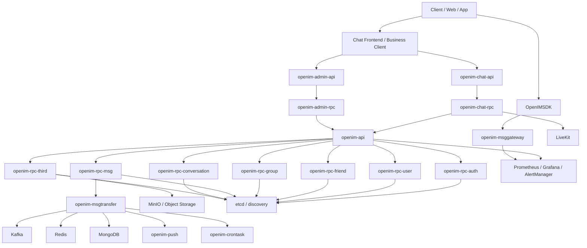
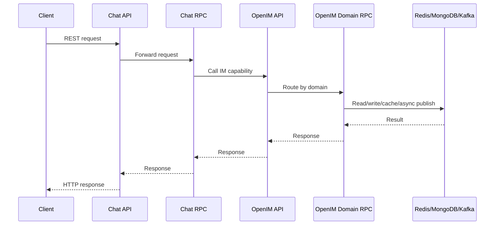
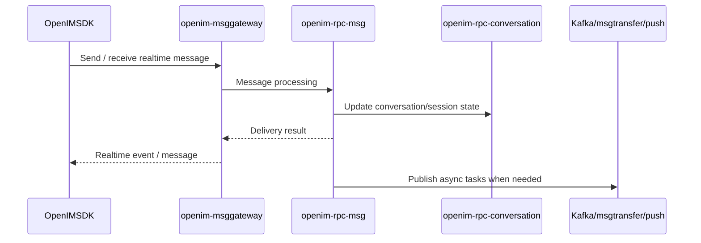
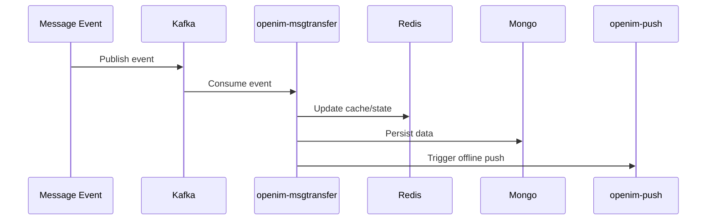
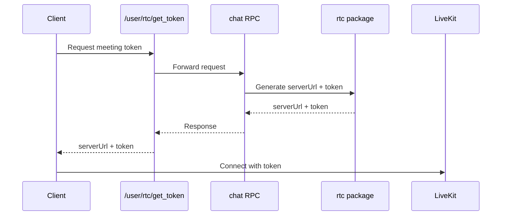

# OpenIM 架构设计说明

## 1. 背景

OpenIM 不是一个直接面向终端用户的成品聊天应用，而是一套面向开发者的即时通讯能力平台。
其目标是为业务系统提供可集成的 IM 基础能力，包括消息发送与接收、用户管理、好友关系、群组管理、会话管理、推送与扩展能力。

在整体体系中：

- `open-im-server` 提供 IM 核心基础设施
- `chat` 提供业务系统层
- `OpenIMSDK` 提供客户端接入能力

因此，OpenIM 的整体架构应理解为“平台层 + 业务层 + 接入层”的组合系统，而不是单体聊天软件。

## 2. 目标与定位

### 2.1 OpenIM Server 的定位

`open-im-server` 是 IM 核心服务平台，负责：

- 实时消息能力
- 用户与认证
- 好友关系
- 群组管理
- 会话管理
- 异步消息处理
- 离线推送
- Webhook 扩展
- 运维与监控支撑

### 2.2 Chat 的定位

`chat` 是构建在 OpenIM Server 之上的业务系统层，负责：

- 用户系统
- 后台管理系统
- 业务 API 封装
- 扩展 REST API
- RTC 令牌获取与 LiveKit 协同

### 2.3 SDK 的定位

`OpenIMSDK` 是客户端接入层，负责：

- 初始化与登录
- 本地存储
- 连接管理
- 监听回调
- 用户、好友、群组、会话等客户端能力封装

## 3. 总体架构

### 3.1 架构分层

```text
客户端 / 前端应用
├─ OpenIMSDK
└─ Chat 前端或业务客户端
   └─ Chat 业务服务
      ├─ openim-chat-api
      ├─ openim-chat-rpc
      ├─ openim-admin-api
      └─ openim-admin-rpc
         └─ OpenIM Server
            ├─ openim-api
            ├─ openim-msggateway
            ├─ openim-rpc-auth
            ├─ openim-rpc-user
            ├─ openim-rpc-friend
            ├─ openim-rpc-group
            ├─ openim-rpc-msg
            ├─ openim-rpc-conversation
            ├─ openim-rpc-third
            ├─ openim-msgtransfer
            ├─ openim-push
            └─ openim-crontask
               └─ 基础设施
                  ├─ Redis
                  ├─ MongoDB
                  ├─ Kafka
                  ├─ MinIO / OSS / COS / AWS / Kodo
                  ├─ etcd / discovery
                  └─ Prometheus / Grafana / AlertManager
```

### 3.2 Mermaid 总览图



### 3.3 核心设计原则

- 微服务拆分
- 领域服务清晰分层
- 对外 REST、对内 RPC
- 实时链路与异步链路分离
- 配置驱动部署
- 支持业务扩展与二次开发

## 4. 核心概念

### 4.1 平台与业务分离

OpenIM 将“即时通讯基础能力”和“业务系统逻辑”分离：

- 平台能力由 `open-im-server` 提供
- 业务逻辑由 `chat` 封装
- 客户端通过 SDK 接入平台能力

### 4.2 领域驱动的服务划分

服务围绕以下核心业务域组织：

- `auth`
- `user`
- `friend`
- `group`
- `msg`
- `conversation`
- `third`

这些业务域既是服务拆分方式，也是 API 家族的主干。

### 4.3 实时处理与异步处理分离

系统将消息处理分为两条链路：

实时链路：
- 长连接
- 在线消息
- 会话同步
- 状态同步

异步链路：
- 消息投递后的落盘
- 推送
- 清理
- 扩散与后台任务

### 4.4 Chat 作为业务扩展服务

`chat` 不仅消费 OpenIM Server 的能力，也可向 OpenIM Server 暴露扩展 REST API，用于满足业务定制需求。

### 4.5 RTC 为外挂式子系统

音视频与会议能力不由 OpenIM Server 内建媒体服务提供，而是通过 `LiveKit` 协同实现。

## 5. 组件说明

## 5.1 OpenIM Server 组件

### 5.1.1 openim-api

职责：

- 对外提供 REST API
- 承接业务系统请求
- 将请求分发至内部 RPC 服务

### 5.1.2 openim-msggateway

职责：

- 实时消息接入
- 在线连接管理
- 多端互踢策略
- 长连接会话控制

### 5.1.3 openim-rpc-auth

职责：

- 认证
- token 管理
- 登录态控制
- 强制登出

### 5.1.4 openim-rpc-user

职责：

- 用户信息
- 账户状态
- 在线状态
- 用户资料更新

### 5.1.5 openim-rpc-friend

职责：

- 好友关系
- 申请管理
- 黑名单管理

### 5.1.6 openim-rpc-group

职责：

- 群组创建
- 群成员管理
- 群资料管理
- 群申请与权限控制

### 5.1.7 openim-rpc-msg

职责：

- 消息发送与处理
- 消息清理
- 消息撤回相关逻辑

### 5.1.8 openim-rpc-conversation

职责：

- 会话管理
- 会话列表维护
- 会话状态管理

### 5.1.9 openim-rpc-third

职责：

- 第三方能力集成
- 对象存储配置与访问相关能力

### 5.1.10 openim-msgtransfer

职责：

- 消息异步流转
- 与 Kafka 等异步链路协同

### 5.1.11 openim-push

职责：

- 离线推送
- 与消息异步处理链路联动

### 5.1.12 openim-crontask

职责：

- 定时后台任务
- 数据保留与清理
- 周期性维护作业

## 5.2 Chat 组件

### 5.2.1 openim-chat-api

职责：

- 用户业务 REST API 入口

### 5.2.2 openim-chat-rpc

职责：

- 用户业务 RPC 实现
- 调用 OpenIM Server 完成 IM 相关业务能力

### 5.2.3 openim-admin-api

职责：

- 后台管理 API 入口

### 5.2.4 openim-admin-rpc

职责：

- 后台管理业务实现

### 5.2.5 Chat User System

职责：

- 登录
- 注册
- 用户资料更新
- 用户信息查询

### 5.2.6 Backend Management System

职责：

- 用户管理
- 群组管理
- 消息管理

### 5.2.7 LiveKit 集成

职责：

- 提供音视频通话和会议媒体能力
- Chat 负责签发 token 并返回服务地址

## 5.3 基础设施组件

### 5.3.1 Redis

职责：

- 缓存
- 热点状态
- 在线/临时状态支撑

### 5.3.2 MongoDB

职责：

- 数据持久化存储

### 5.3.3 Kafka

职责：

- 异步事件总线
- 解耦消息后处理

### 5.3.4 MinIO 及对象存储

职责：

- 文件与对象资源存储

### 5.3.5 etcd / discovery

职责：

- 服务注册与发现

### 5.3.6 Prometheus / Grafana / AlertManager

职责：

- 监控
- 指标采集
- 告警
- 可视化

## 6. 关键交互时序

### 6.1 Mermaid 业务请求时序图



### 6.2 业务请求处理时序

```text
Client
-> Chat REST API
-> Chat API Handler
-> Chat RPC
-> OpenIM API
-> OpenIM Domain RPC
-> Redis / MongoDB / Kafka / 其他依赖
-> Response
```

适用场景：

- 用户登录
- 用户注册
- 用户信息操作
- 群组与消息管理
- 管理后台操作

### 6.3 Mermaid 实时消息时序图



### 6.4 实时消息处理时序

```text
Client SDK
-> openim-msggateway
-> openim-rpc-msg / conversation / group
-> Realtime delivery
-> Async pipeline if needed
```

适用场景：

- 在线消息收发
- 在线状态同步
- 多端实时消息同步

### 6.5 Mermaid 异步处理时序图



### 6.6 异步处理时序

```text
Message Event
-> Kafka
-> openim-msgtransfer
-> Redis / MongoDB
-> openim-push
-> Offline notification / persistence / later processing
```

适用场景：

- 离线消息
- 推送通知
- 数据落盘
- 后台扩散处理

### 6.7 Mermaid RTC 时序图



### 6.8 RTC 处理时序

```text
Client
-> Chat /user/rtc/get_token
-> Chat RPC
-> rtc package
-> return LiveKit serverUrl + token
-> Client connects LiveKit
```

适用场景：

- 音视频通话
- 视频会议

## 7. API 设计结构

### 7.1 OpenIM Server API 家族树

```text
OpenIM Server API
├─ Auth
│  ├─ get_token
│  └─ force_logout
├─ User
│  ├─ user_register
│  ├─ check_account
│  ├─ check_user_account
│  ├─ get_users
│  ├─ get_users_info
│  ├─ get_users_online_status
│  ├─ update_user_info
│  ├─ get_subscribe_users_status
│  ├─ subscribe_users_status
│  └─ set_global_msg_recv_opt
├─ Friend
│  ├─ is_friend
│  ├─ add_friend
│  ├─ get_friend_list
│  ├─ get_friend_apply_list
│  ├─ get_self_friend_apply_list
│  ├─ add_black
│  ├─ remove_black
│  └─ get_black_list
├─ Group
│  ├─ create_group
│  ├─ invite_user_to_group
│  ├─ transfer_group
│  ├─ get_groups_info
│  ├─ kick_group
│  ├─ get_group_members_info
│  ├─ get_group_member_list
│  ├─ get_joined_group_list
│  ├─ set_group_member_info
│  ├─ set_group_info
│  ├─ mute_group
│  ├─ cancel_mute_group
│  ├─ cancel_mute_group_member
│  ├─ dismiss_group
│  ├─ quit_group
│  ├─ get_recv_group_application_list
│  ├─ group_application_response
│  └─ join_group
├─ Message
│  ├─ send_msg
│  ├─ revoke_msg
│  └─ user_clear_all_msg
├─ Conversation
│  └─ conversation/session management
├─ Third
│  └─ object storage / third-party integration
├─ Webhooks
│  ├─ before message send
│  ├─ after message send
│  ├─ add friend event
│  └─ create group event
├─ Realtime
│  └─ msggateway / websocket
└─ Internal Async
   ├─ msgtransfer
   ├─ push
   └─ crontask
```

### 7.2 Chat API 家族树

```text
OpenIM Chat API
├─ User System API
│  ├─ /user/update
│  ├─ /user/find/public
│  ├─ /user/find/full
│  ├─ /user/search/public
│  ├─ /user/search/full
│  └─ /user/rtc/get_token
├─ Backend Management API
│  ├─ user management
│  ├─ group management
│  └─ message management
├─ Chat RPC
│  └─ chat service
│     └─ GetTokenForVideoMeeting
├─ Extension API
│  └─ business REST APIs callable by OpenIM Server
└─ RTC Integration
   └─ LiveKit token / server url related APIs
```

## 8. 部署依赖

### 8.1 OpenIM Server 运行依赖

最低核心依赖包括：

- Redis
- MongoDB
- Kafka
- MinIO
- service discovery
- 配套配置文件

### 8.2 Chat 运行依赖

Chat 依赖：

- 已部署的 OpenIM Server
- 与 OpenIM Server 连通的 `openIM.apiURL`
- 与 OpenIM Server 一致的 `openIM.secret`
- MongoDB
- Redis
- Kubernetes 或源码运行环境

### 8.3 RTC 依赖

启用 RTC 时还需要：

- LiveKit 服务
- Chat 中配置 `liveKit.url`

## 9. 扩展机制

### 9.1 Webhook 扩展

OpenIM Server 支持在特定事件前后回调业务系统，例如：

- 发送消息前
- 发送消息后
- 添加好友
- 创建群组

### 9.2 Chat REST 扩展

Chat 支持通过新增 REST API + RPC 方法实现业务扩展。
标准路径为：

1. 在 `.proto` 中定义消息和 RPC
2. 生成 protobuf 代码
3. 在路由中注册 REST URL
4. 在 API 层转发
5. 在 RPC 层实现业务逻辑

### 9.3 第三方集成扩展

通过 `openim-rpc-third` 及对象存储相关配置，可以接入不同存储和第三方资源系统。

## 10. 风险与边界

### 10.1 架构复杂度

由于系统是微服务架构，部署、运维、调试复杂度高于单体应用。

### 10.2 基础设施依赖重

Kafka、MongoDB、Redis、MinIO、服务发现、监控栈共同构成运行底座，任何一个关键依赖异常都可能影响系统能力。

### 10.3 Chat 强依赖 OpenIM Server

Chat 不是独立运行平台，必须依赖 OpenIM Server。

### 10.4 RTC 是外部依赖能力

音视频能力依赖 LiveKit，RTC 不是 OpenIM 原生消息服务的一部分。

## 11. 阅读路径建议

建议按照以下顺序理解整个系统：

1. `open-im-server/README.md`
2. `chat/README.md`
3. `open-im-server/config/README.md`
4. `chat/deployments/README.md`
5. `chat/HOW_TO_ADD_REST_RPC_API.md`
6. `chat/HOW_TO_SETUP_LIVEKIT_SERVER.md`
7. `open-im-server/docs/contrib/test.md`

## 12. 文档依据

本说明主要基于以下文档整理：

- `open-im-server/README.md`
- `open-im-server/config/README.md`
- `open-im-server/docs/contrib/environment.md`
- `open-im-server/docs/contrib/test.md`
- `open-im-server/docs/contrib/api.md`
- `open-im-server/test/e2e/README.md`
- `chat/README.md`
- `chat/deployments/README.md`
- `chat/HOW_TO_ADD_REST_RPC_API.md`
- `chat/HOW_TO_SETUP_LIVEKIT_SERVER.md`
- `chat/docs/conversions/api.md`
