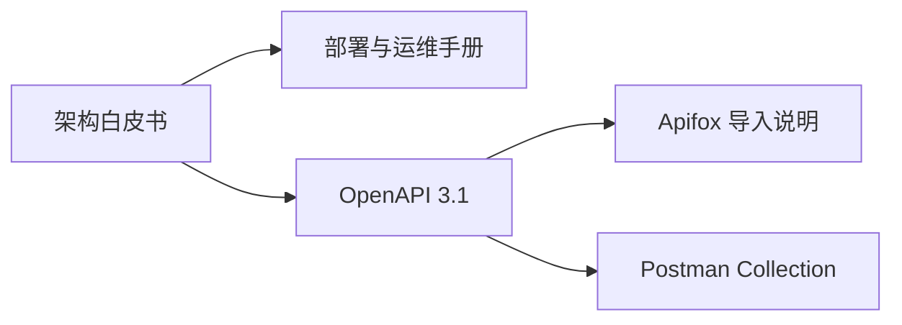

# OpenCode 中文文档入口

本目录汇总了基于当前仓库实现整理出的中文架构、接口与运维文档，适合作为团队内部阅读入口。

| 门户信息     | 内容                                       |
| ------------ | ------------------------------------------ |
| 文档门户版本 | `v1.0`                                     |
| 适用范围     | 当前仓库实现、中文补充文档与接口草案       |
| 使用方式     | 作为中文知识库首页、交接入口和评审资料索引 |

## 门户摘要

如果你需要快速理解 OpenCode，请先阅读架构白皮书；如果你要把服务真正跑起来并稳定维护，请直接阅读部署与运维手册；如果你要做接口联调与 Mock，请从 OpenAPI 和 Apifox 导入说明开始。

## 文档状态说明

- 这套中文文档是基于当前代码与仓库英文资料整理出的补充材料。
- 它们适合作为内部知识库和评审材料。
- 对于严格 schema 级接口定义，请以代码实现和自动生成文档为最终依据。

## 推荐阅读路径

### 面向架构师 / 技术负责人

1. [`opencode-architecture-whitepaper-zh.md`](./opencode-architecture-whitepaper-zh.md)
2. [`opencode-deployment-ops-manual-zh.md`](./opencode-deployment-ops-manual-zh.md)
3. [`opencode-openapi-3.1.json`](./opencode-openapi-3.1.json)

### 面向平台工程师 / 运维团队

1. [`opencode-deployment-ops-manual-zh.md`](./opencode-deployment-ops-manual-zh.md)
2. [`opencode-architecture-whitepaper-zh.md`](./opencode-architecture-whitepaper-zh.md)
3. [`apifox-import-guide.md`](./apifox-import-guide.md)

### 面向前端 / 客户端 / 接口联调人员

1. [`opencode-openapi-3.1.json`](./opencode-openapi-3.1.json)
2. [`apifox-import-guide.md`](./apifox-import-guide.md)
3. [`opencode-postman-collection.json`](./opencode-postman-collection.json)

## 文档清单

| 文档                                                                                 | 作用                                         | 适用读者                       |
| ------------------------------------------------------------------------------------ | -------------------------------------------- | ------------------------------ |
| [`opencode-architecture-whitepaper-zh.md`](./opencode-architecture-whitepaper-zh.md) | 系统级架构说明、核心概念、交互链路与安全边界 | 架构师、负责人、平台团队       |
| [`opencode-deployment-ops-manual-zh.md`](./opencode-deployment-ops-manual-zh.md)     | 安装、配置、启动、监控、备份与排障手册       | 运维、平台工程师、内部部署团队 |
| [`opencode-openapi-3.1.json`](./opencode-openapi-3.1.json)                           | 可导入 Apifox 的 OpenAPI 3.1 草案            | 前后端联调、接口维护者         |
| [`apifox-import-guide.md`](./apifox-import-guide.md)                                 | Apifox 导入与 Mock 使用说明                  | 前端、测试、接口使用者         |
| [`opencode-postman-collection.json`](./opencode-postman-collection.json)             | Postman Collection 草案                      | 接口调试人员                   |

## 文档之间的关系

## 使用建议

- 如果你先要理解系统，先看白皮书。
- 如果你先要把服务跑起来，先看运维手册。
- 如果你先要做接口联调，先导入 OpenAPI 和 Apifox 说明。

## 版本适配说明

- 当 `session`、`message`、`provider`、`mcp`、`desktop`、`sync` 相关实现发生显著调整时，应同步更新对应中文文档。
- 当 API 路由或请求体变更时，应优先更新：
  - `opencode-openapi-3.1.json`
  - `apifox-import-guide.md`
  - `opencode-postman-collection.json`
- 当部署方式、目录结构、日志策略或数据库位置变更时，应优先更新运维手册。

## 变更记录

| 版本   | 说明                                                                        |
| ------ | --------------------------------------------------------------------------- |
| `v1.0` | 初始建立中文文档门户，包含白皮书、运维手册、OpenAPI、Apifox 与 Postman 资料 |

## 文档维护规范

- 新增文档时，应在本页补充“文档清单”和“推荐阅读路径”。
- 重要文档改版时，应更新“变更记录”。
- 若文档间存在依赖关系变化，应同步更新“文档之间的关系”图。
- 若有新角色读者出现，应补充新的阅读路径分组。

## 说明

这些文档是基于当前仓库代码、英文 Markdown 文档和基础设施定义整理出的中文版资料。

它们适合作为：

- 内部知识库
- 交接文档
- 项目评审材料
- 接口联调和 Mock 基础文档
