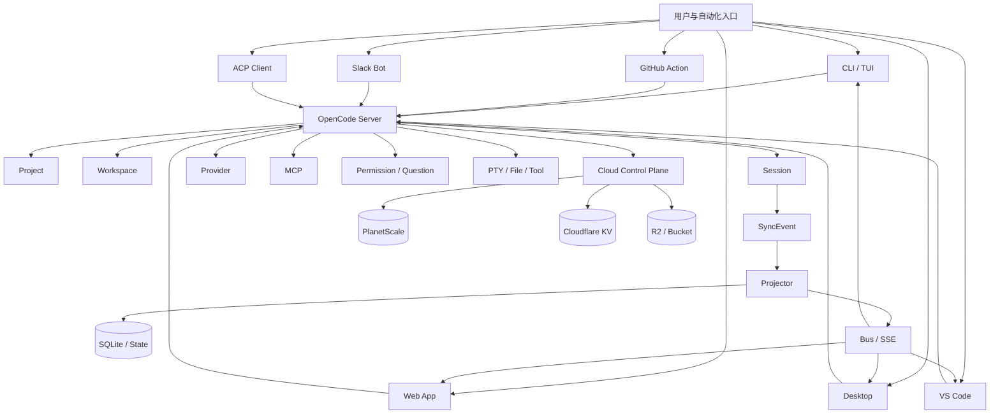
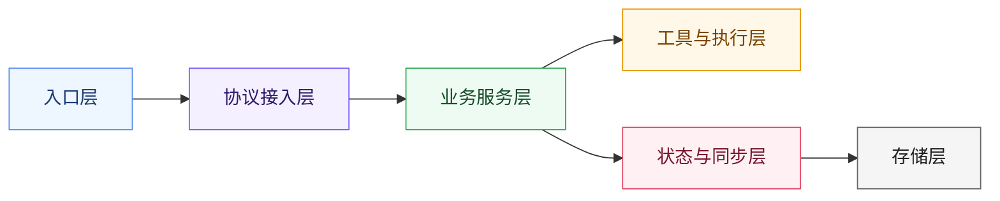
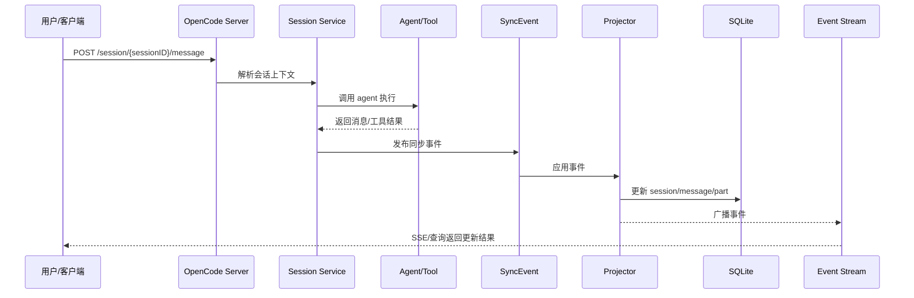
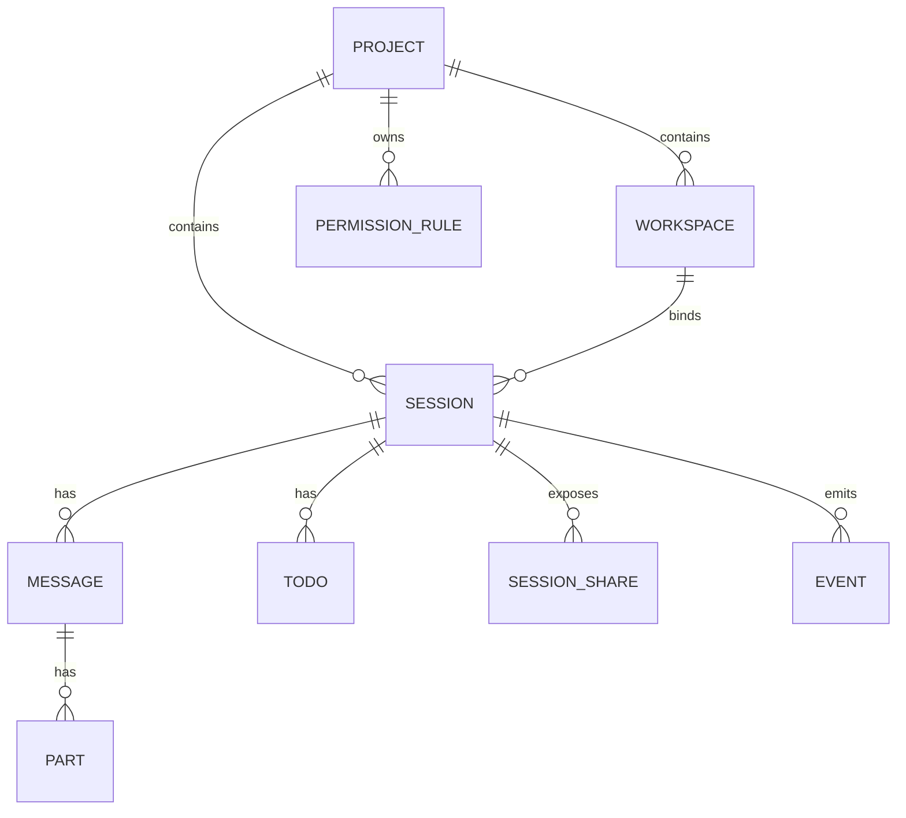

# OpenCode 架构白皮书

> 文档定位：面向架构师、平台团队和技术管理者的系统级说明文档。
>
> 配套文档：
>
> - 部署与运维手册：[`opencode-deployment-ops-manual-zh.md`](./opencode-deployment-ops-manual-zh.md)
> - OpenAPI 文档：[`opencode-openapi-3.1.json`](./opencode-openapi-3.1.json)
> - Apifox 导入说明：[`apifox-import-guide.md`](./apifox-import-guide.md)

| 元信息       | 内容                       |
| ------------ | -------------------------- |
| 文档版本     | `v1.0`                     |
| 文档语言     | 中文                       |
| 文档类型     | 架构白皮书                 |
| 适配范围     | 当前仓库主干实现与配套文档 |
| 建议维护方式 | 代码变更后按章节增量更新   |

## 摘要

OpenCode 是一个本地优先、以会话为核心、支持多入口接入的 AI 编程代理运行时。它通过 `session` 组织交互上下文，通过 `tool` 执行真实动作，通过 `sync event + projector + bus` 维持状态一致性，并以 `HTTP + SSE + WebSocket + ACP` 形成统一接入面。

对于架构设计而言，OpenCode 的关键不在于单一前端或单一模型接入，而在于它如何把项目、工作区、会话、消息、权限、外部 provider、外部 MCP 工具和本地执行环境整合成一个可扩展、可同步、可回放的运行时系统。

## 读者指引

如果你是第一次阅读，建议按以下顺序：

1. 先看“系统定位”和“核心概念模型”，建立系统边界感。
2. 再看“总体架构分层”和“核心交互流程”，理解主链路。
3. 如果你关注数据与安全，继续看“数据架构与存储设计”和“安全模型”。
4. 如果你关注实际落地，请直接跳转到运维手册：[`opencode-deployment-ops-manual-zh.md`](./opencode-deployment-ops-manual-zh.md)

## 版本与适配说明

- 本文档基于当前仓库中的实现、基础设施定义与文档进行整理。
- 文档中的 API 结构、桌面端形态、MCP 能力与同步模型，均以当前代码事实为准。
- 若未来 `session v2`、`ACP`、`desktop / desktop-electron`、`message shape` 发生显著演进，应优先回看本白皮书中的以下章节：
  - API 架构
  - 核心概念模型
  - 部署形态
  - 已知文档缺口与演进方向

## 文档维护规范

- 当新增核心业务对象时，优先补“核心概念模型”和“附录 A. 关键对象总表”。
- 当新增外部入口或接入协议时，优先补“总体架构分层”和“核心交互流程”。
- 当变更数据模型或同步机制时，优先补“数据架构与存储设计”“同步与一致性设计”。
- 当变更安全策略时，必须同步更新“安全模型”。
- 当变更部署拓扑时，必须同步更新 Mermaid 图与部署形态描述。

## 目录

- [1. 文档目的](#1-文档目的)
- [2. 系统定位](#2-系统定位)
- [3. 核心概念模型](#3-核心概念模型)
- [4. 总体架构分层](#4-总体架构分层)
- [5. 功能组件说明](#5-功能组件说明)
- [6. 核心交互流程](#6-核心交互流程)
- [7. API 架构](#7-api-架构)
- [8. 数据架构与存储设计](#8-数据架构与存储设计)
- [9. 安全模型](#9-安全模型)
- [10. 同步与一致性设计](#10-同步与一致性设计)
- [11. 部署形态](#11-部署形态)
- [12. 可观测性与运维特征](#12-可观测性与运维特征)
- [13. 已知文档缺口与演进方向](#13-已知文档缺口与演进方向)
- [14. 结论](#14-结论)
- [附录 A. 关键对象总表](#附录-a-关键对象总表)
- [附录 B. 术语表](#附录-b-术语表)

## 架构总览图

## 1. 文档目的

本文档基于当前仓库中的英文 Markdown、核心服务端实现、基础设施定义与数据模型整理而成，目标是用正式、系统的方式说明 OpenCode 的总体架构、核心概念、功能组件、交互链路、API 组织、安全边界、数据管理与部署形态。

本文档适合以下读者：

- 架构师
- 平台工程师
- 二次开发者
- 企业部署与运维团队
- 需要从整体理解 OpenCode 的产品和研发负责人

本文档重点回答以下问题：

- OpenCode 的系统边界是什么
- 系统的核心对象与模块如何组织
- 多入口客户端如何与核心服务交互
- 状态如何同步、持久化与回放
- API 如何组织与演进
- 系统安全依赖什么，不依赖什么
- 本地与云端分别如何部署和运维

## 2. 系统定位

OpenCode 是一个以本地执行为核心、支持多入口接入、围绕 AI 编程代理会话组织能力的运行时系统。

从系统形态上看，它不是单纯的聊天客户端，也不是单纯的云端平台，而是一个由以下几个层次组成的产品体系：

- 本地 AI coding runtime
- 本地 HTTP/SSE/WebSocket/ACP 服务
- 多前端入口与自动化入口
- 会话驱动的状态模型
- 基于事件流的同步与回放机制
- 可选的云端控制面和企业能力

OpenCode 的关键设计理念包括：

- 本地优先
- 会话优先
- 多入口统一接入
- 事件驱动同步
- Provider-agnostic
- 工具可扩展
- 安全边界显式声明

## 3. 核心概念模型

### 3.0 关键对象速览

| 对象         | 定义                   | 作用                           | 典型关系                                   |
| ------------ | ---------------------- | ------------------------------ | ------------------------------------------ |
| `Project`    | 被 OpenCode 管理的项目 | 顶层资源容器                   | 1 个 project 下有多个 workspace 和 session |
| `Workspace`  | 项目中的工作空间上下文 | 描述分支、目录、连接状态       | 属于 project，可被 session 绑定            |
| `Session`    | AI 编程交互单元        | 承载上下文、消息、权限、状态   | 属于 project/workspace，可 fork 出子会话   |
| `Message`    | 一条消息的元信息       | 记录用户/助手交互节点          | 属于 session                               |
| `Part`       | 消息片段               | 支持流式输出、分页与编辑       | 属于 message                               |
| `Agent`      | 代理运行模式           | 决定提示词、工具和执行策略     | session 在运行时绑定 agent                 |
| `Tool`       | 真实执行能力           | 读写代码、执行命令、联网和提问 | 被 agent 调用                              |
| `Permission` | 工具使用规则           | 控制 allow/deny/ask            | 作用于 tool 和路径                         |
| `Question`   | 补充信息请求           | 在信息不足时向用户追问         | 运行中由 agent 触发                        |
| `SyncEvent`  | 同步层事件             | 驱动状态更新与回放             | 被 projector 消费                          |
| `BusEvent`   | 事件总线消息           | 广播给客户端和兼容层           | 通常由同步事件桥接产生                     |

### 3.1 Project

`Project` 是 OpenCode 顶层业务对象，用于表示一个被 OpenCode 管理的代码项目。

一个 project 一般包含：

- 项目 ID
- 名称与图标
- worktree 信息
- 版本控制信息
- sandbox/worktree 列表
- 命令配置

Project 是 session、workspace、permission 等资源的容器。

### 3.2 Workspace

`Workspace` 是 project 下更细粒度的执行单元，用于描述一个具体工作空间上下文。

它通常包含：

- workspace ID
- 所属 project ID
- 分支信息
- 目录信息
- 连接状态
- 控制面附加元数据

Workspace 常用于：

- 多 worktree 并行开发
- 企业控制面分发工作区
- 将某个 session 绑定到更明确的执行上下文

### 3.3 Session

`Session` 是 OpenCode 最重要的业务对象，是所有 AI 编程交互的核心单位。

Session 管理以下内容：

- 当前对话上下文
- 用户消息与助手消息
- 子会话与 fork 关系
- 分享状态
- 摘要压缩状态
- 回滚状态
- 权限规则
- 待办列表
- 运行状态

从架构上讲，OpenCode 是一个 session-first 系统，而不是 project-first CRUD 系统。

### 3.4 Message 与 Part

会话中的具体内容由消息系统表示。

- `Message` 表示一条完整消息的元信息
- `Part` 表示消息中的一个片段

这种设计支持：

- 流式输出
- 多段内容聚合
- 更精细的消息编辑
- 更可靠的消息重放
- 分页与游标加载

### 3.5 Agent

OpenCode 内部围绕 agent 模式组织 AI 能力。

当前系统中至少存在：

- `build` 类型主代理
- `plan` 类型主代理
- 子代理如 `general`

Agent 的职责包括：

- 读取上下文
- 选择模型与 provider
- 调用工具
- 产生命令、消息和结构化输出

### 3.6 Tool

Tool 是代理真正执行工作的能力抽象。

典型工具包括：

- shell 执行
- 文件读取
- 文件搜索
- 内容搜索
- 编辑补丁
- Web 抓取
- 子代理调用
- PTY/终端
- LSP 和符号相关能力
- MCP 外部工具接入

Tool 不是附属系统，而是 OpenCode 运行时的第一层能力平面。

### 3.7 Permission

Permission 用于控制 AI 代理对某些高风险工具或路径的访问方式。

其动作模型为：

- `allow`
- `deny`
- `ask`

但它只是一层交互式控制和规则系统，不构成真正的操作系统级安全隔离。

### 3.8 SyncEvent 与 BusEvent

OpenCode 的状态变更采用事件驱动设计。

- `SyncEvent` 是同步层事件，承担一致性、回放和跨端同步职责
- `BusEvent` 是事件总线事件，用于客户端订阅与兼容已有事件消费逻辑

关键关系是：

- 变更先产生同步事件
- projector 处理事件并更新状态
- 同步事件再桥接到总线事件

### 3.9 Projector

Projector 是事件驱动状态更新的执行者。

其职责是：

- 消费同步事件
- 对数据库状态做落地更新
- 将事件结果转换为系统可查询状态

### 3.10 Control Plane

OpenCode 除了本地运行时之外，还存在控制平面能力，用于支撑：

- 企业账号
- 控制台组织切换
- 工作区控制
- 商业版功能
- 云端状态编排

## 4. 总体架构分层

OpenCode 可以拆成 6 层。

### 4.1 入口层

用户或自动化系统可从多个入口接入 OpenCode：

- CLI / TUI
- Web App
- Desktop
- VS Code 扩展
- GitHub Action
- Slack Bot
- ACP Client

这些入口在交互方式上不同，但都围绕 project、workspace、session 和事件流展开。

### 4.2 协议接入层

协议层负责把不同终端入口统一接到核心服务：

- HTTP REST
- SSE
- WebSocket
- ACP over stdio
- Slack message/thread
- GitHub comment/workflow

服务端底层使用 Hono 组织路由，并自动暴露 OpenAPI 文档。

### 4.3 业务服务层

业务层负责处理核心对象生命周期。

主要模块包括：

- Project
- Session
- MessageV2
- Permission
- Question
- Provider
- MCP
- Config
- File
- PTY
- Worktree
- Workspace

### 4.4 工具与执行层

这一层负责执行真实动作。

包括：

- 文件系统操作
- 搜索能力
- Shell 与 PTY
- LSP
- 外部 provider 调用
- MCP server 调用
- 代理工具编排

### 4.5 状态与同步层

OpenCode 用事件流来处理一致性。

基本链路是：

1. 用户请求触发业务动作
2. 业务动作生成 `SyncEvent`
3. projector 应用事件并更新状态
4. 更新结果重新广播成 `BusEvent`
5. 客户端通过 SSE 订阅状态变化

这种设计使 OpenCode 具备：

- 可回放
- 可同步
- 易审计
- 易增量订阅

### 4.6 存储层

本地核心存储以 SQLite 为主，配合少量历史文件迁移能力。

云端能力则依赖：

- PlanetScale
- Cloudflare KV
- Cloudflare Bucket/R2
- Stripe

## 分层交互图

- Secret 管理系统

## 5. 功能组件说明

### 5.1 `packages/opencode`

这是核心运行时包，承担：

- CLI
- TUI
- 本地 server
- session 生命周期管理
- provider 与模型管理
- permission 与 question 流程
- 存储与同步

### 5.2 `packages/opencode/src/server`

负责：

- REST API
- SSE 流
- WebSocket PTY
- OpenAPI 文档输出
- CORS 与鉴权中间件
- 内嵌 Web UI 或 app.opencode.ai 代理

### 5.3 `packages/opencode/src/session`

负责：

- session 创建、更新、删除
- 消息管理
- 会话分页
- 压缩摘要
- 回滚与恢复
- fork
- 运行中断

### 5.4 `packages/opencode/src/sync`

负责：

- 同步事件定义
- 事件订阅
- 单写者事件序列
- 事件回放
- projector 更新链路

### 5.5 `packages/opencode/src/acp`

实现 ACP 协议，使 OpenCode 可作为 Agent Client Protocol 服务端工作。

适合被编辑器或第三方客户端接入。

### 5.6 `packages/app`

Web 前端，承担：

- UI 展示
- 会话浏览与交互
- 连接本地 server

### 5.7 `packages/desktop`

当前 Tauri 桌面实现。

特征：

- 原生桌面包装
- 携带 sidecar CLI
- 调用本地 server
- 支持 updater、dialog、store 等系统插件

### 5.8 `packages/desktop-electron`

Electron 桌面实现，当前仍参与 CI 构建与发布流程。

它不是已完全废弃的目录，而是与 Tauri 并存的一条桌面分支。

### 5.9 `sdks/vscode`

VS Code 扩展，用于把本地 OpenCode 工作流嵌入编辑器。

### 5.10 `github`

GitHub Action 集成。

把 issue comment 或 PR comment 转为 OpenCode 执行任务的触发入口。

### 5.11 `packages/slack`

Slack Bot 集成。

以 thread -> session 的方式把 Slack 协作消息接入 OpenCode。

### 5.12 `packages/console` 与 `packages/enterprise`

面向控制台与企业版能力。

主要承担：

- 组织切换
- 控制面能力
- 商业化能力
- 云端前端与函数

## 6. 核心交互流程

本章描述的是系统运行中的“主链路”，也就是一个请求如何从客户端进入、如何被代理处理、如何写入状态、以及如何再广播回各个前端。

## 典型请求时序图

### 6.1 本地交互主链路

典型流程如下：

1. 用户从 TUI、Web、桌面端或 VS Code 发起请求
2. 请求进入本地 server
3. server 将请求映射到当前 `project / workspace / session`
4. session 模块调用 agent 与 tool 处理任务
5. 过程中的状态变化生成同步事件
6. projector 更新数据库状态
7. 结果通过查询接口与 SSE 推送给客户端

### 6.2 消息发送链路

以 `POST /session/{sessionID}/message` 为例：

1. 客户端提交 prompt parts
2. SessionPrompt 读取会话上下文
3. Agent 选择模型与 provider
4. Agent 调用工具执行任务
5. AI 输出生成消息和 part
6. 状态写入 message/part/session 相关表
7. 事件广播给 UI

### 6.3 权限请求链路

当代理执行某些高风险工具时：

1. 根据规则集评估工具权限
2. 若规则为 `allow`，直接放行
3. 若规则为 `deny`，直接拒绝
4. 若规则为 `ask`，创建待审批 permission request
5. 客户端通过 permission API 回复 `once / always / reject`
6. 系统根据用户回复继续、长期放行或终止当前调用

### 6.4 问题请求链路

当代理缺少必要信息时：

1. 生成 question request
2. 通过 question API 暴露给客户端
3. 用户提交答案或拒绝
4. 代理恢复执行流程

### 6.5 MCP 接入链路

1. 配置 MCP server
2. server 启动时尝试连接
3. 对于 remote MCP，优先尝试 StreamableHTTP 和 SSE transport
4. 若需 OAuth，进入认证流程
5. 成功后缓存 tool definitions
6. MCP 工具被注入 agent 可用工具集

### 6.6 PTY 链路

1. 客户端创建 PTY session
2. server 启动真实 shell 进程
3. 终端输出缓冲到内存 buffer
4. 客户端通过 WebSocket 连接 PTY
5. server 增量推送终端输出并接收输入

## 7. API 架构

如需查看可导入的接口文档与 Mock 定义，请同时参考：[`opencode-openapi-3.1.json`](./opencode-openapi-3.1.json)

OpenCode 的 API 组织方式是“全局控制面 + 实例资源面”。

### 7.1 全局控制面

负责：

- 健康检查
- 全局配置
- 全局事件流
- 全局同步事件流
- 全局实例释放
- 程序升级

典型路由：

- `/global/health`
- `/global/event`
- `/global/sync-event`
- `/global/config`
- `/global/dispose`
- `/global/upgrade`

### 7.2 资源面

按资源前缀组织：

- `/project`
- `/session`
- `/provider`
- `/mcp`
- `/permission`
- `/question`
- `/config`
- `/file`
- `/pty`
- `/experimental`
- `/tui`

### 7.3 协议特征

API 并非纯 REST 系统，还混合了：

- REST
- SSE
- WebSocket
- OpenAPI
- ACP

### 7.4 演进特征

系统正在逐步向更干净的 v2 API 收敛，典型体现是：

- `session.init` 计划移除
- message shape 持续重构
- ACP 能力持续增强

## 8. 数据架构与存储设计

这一章关注的是“状态落在哪里、如何被组织、如何被恢复”，不是对象的业务含义本身。

## 核心数据关系图

### 8.1 本地存储

OpenCode 本地核心数据默认存于 XDG data 目录下的 SQLite 数据库。

典型路径：

- `~/.local/share/opencode/opencode.db`
- `~/.local/share/opencode/opencode.db-wal`
- `~/.local/share/opencode/opencode.db-shm`

支持通过环境变量覆盖数据库路径。

### 8.2 本地主要表

主要包括：

- `project`
- `workspace`
- `session`
- `message`
- `part`
- `todo`
- `permission`
- `session_share`
- `event_sequence`
- `event`
- `account`
- `account_state`

### 8.3 存储设计特点

- 使用 Drizzle 定义 schema
- 采用 SQLite WAL 模式
- JSON 字段较多，兼顾灵活性和结构化查询
- 外键与索引较完整
- 可支持事件驱动回放

### 8.4 历史兼容

OpenCode 历史上存在 JSON 文件式存储。

当前代码保留迁移能力，用于把旧的 project/session/message/part 数据迁移进 SQLite。

### 8.5 日志存储

本地日志默认写入：

- `~/.local/share/opencode/log`

日志特点：

- 结构化日志
- 非 dev 模式按时间戳文件命名
- dev 模式使用 `dev.log`
- 自动清理旧日志文件，主要按文件数量保留

### 8.6 云端数据平面

云端控制面和企业能力使用：

- PlanetScale
- Cloudflare KV
- Cloudflare Bucket/R2
- Stripe

## 9. 安全模型

本章非常重要。OpenCode 的安全边界与许多托管式 SaaS 产品不同，必须把“本地真实执行”作为前提来理解。

### 9.1 安全边界声明

OpenCode 明确声明自己不是沙箱产品。

这意味着：

- 权限系统不是隔离边界
- OpenCode 本地执行具有真实系统权限
- 对高风险仓库应在 Docker 或 VM 中运行

### 9.2 本地运行安全特征

- 默认本地使用
- server mode 显式开启
- 可选 Basic Auth
- CORS 限制本地与允许域名

### 9.3 外部系统信任边界

以下对象不在 OpenCode 信任边界内：

- 外部 LLM provider
- 外部 MCP server
- 被篡改的用户本地配置

### 9.4 远程暴露安全要求

如果把 OpenCode 作为远程服务暴露，建议至少增加：

- `OPENCODE_SERVER_PASSWORD`
- 反向代理
- 访问控制
- VPN 或内网隔离

## 10. 同步与一致性设计

### 10.1 事件先行

OpenCode 的同步模型不是直接修改所有业务表，而是通过事件触发状态变化。

### 10.2 单写者模型

当前同步系统采用单写者事件序列思路，避免复杂分布式时钟和多主冲突。

### 10.3 projector 落库

事件进入同步层后由 projector 应用到本地状态。

### 10.4 订阅与广播

客户端可通过 SSE 获取：

- 实例事件
- 全局事件
- 全局同步事件

### 10.5 回放与重建

由于系统使用事件和结构化消息模型，天然具备较强的回放能力。

## 11. 部署形态

如需具体执行步骤，请配套阅读：[`opencode-deployment-ops-manual-zh.md`](./opencode-deployment-ops-manual-zh.md)

### 11.1 本地单机部署

最常见形态是本地开发机运行：

- TUI
- 本地 server
- Web/桌面 UI 连接本地服务

### 11.2 桌面部署

存在两条桌面实现：

- Tauri：`packages/desktop`
- Electron：`packages/desktop-electron`

### 11.3 编辑器嵌入部署

- VS Code 扩展
- ACP 对接编辑器

### 11.4 自动化入口部署

- GitHub Action
- Slack Bot

### 11.5 云端控制面部署

生产环境使用 SST 编排，主要运行在 Cloudflare 平台，配合 PlanetScale、R2/KV、Stripe 等组件。

## 12. 可观测性与运维特征

### 12.1 本地可观测性

- 结构化日志
- 请求耗时日志
- `/log` 客户端上报日志接口
- SSE heartbeat

### 12.2 云端可观测性

- Cloudflare logpush
- tail consumer
- Honeycomb 接入

### 12.3 运维限制

当前仓库没有完整提供：

- 正式灾备脚本
- 统一备份恢复脚本
- 平台级日志保留策略文档

## 13. 已知文档缺口与演进方向

当前系统仍有以下文档层面空白或需要持续维护的区域：

- 更完整的真实 schema 级 OpenAPI 文档
- 更严格的 `message / part / config / experimental` schema 对齐
- 云端灾备与恢复 runbook
- 更明确的桌面双栈策略说明

预计后续演进方向包括：

- 收敛 session v2 API
- 优化 message shape
- 完善 ACP
- 增强同步与多端协同

## 14. 结论

OpenCode 的本质不是一个单体聊天应用，而是一个围绕 AI 编程代理构建的本地优先运行时系统。

它的技术特征可以概括为：

- 以 `session` 为中心的业务模型
- 以 `tool` 为核心执行平面
- 以 `event log + projector + bus` 为状态骨架
- 以 `HTTP + SSE + WebSocket + ACP` 为接入协议层
- 以 `SQLite + 历史迁移兼容 + 云端控制面` 为存储体系

它的安全模型也同样清晰：

- 本地信任优先
- 远程暴露需要自行加固
- 权限系统不是沙箱
- 外部 provider 和 MCP 不在信任边界内

对于希望把 OpenCode 引入团队工程体系的组织，最重要的工作不是单纯安装，而是：

- 正确认识其本地执行特性
- 在网络边界和运行环境上补足隔离
- 按 session、provider、mcp、permission、event 的视角组织运维与治理

从实践角度看，这意味着 OpenCode 最适合被当作“本地 AI 工程运行时”而不是“普通聊天产品”来部署和治理。

## 附录 A. 关键对象总表

| 领域       | 对象       | 主要职责                          | 是否持久化 |
| ---------- | ---------- | --------------------------------- | ---------- |
| 项目域     | Project    | 顶层项目管理、worktree 与命令配置 | 是         |
| 工作空间域 | Workspace  | 分支/目录/连接状态管理            | 是         |
| 会话域     | Session    | 对话、执行状态、分享、回滚、摘要  | 是         |
| 消息域     | Message    | 消息节点管理                      | 是         |
| 消息域     | Part       | 消息片段管理                      | 是         |
| 任务域     | Todo       | 会话待办项                        | 是         |
| 安全交互域 | Permission | allow/deny/ask 规则与待审批请求   | 是         |
| 用户交互域 | Question   | 运行时补充信息提问                | 运行时为主 |
| 执行域     | PTY        | 终端会话和实时 I/O                | 运行时为主 |
| 外部模型域 | Provider   | 模型和认证接入                    | 配置+状态  |
| 外部工具域 | MCP        | 本地/远程 MCP 服务接入            | 配置+状态  |
| 同步域     | SyncEvent  | 一致性、同步与回放                | 是         |
| 兼容广播域 | BusEvent   | 客户端事件广播                    | 运行时为主 |

## 附录 B. 术语表

| 术语          | 含义                                                                    |
| ------------- | ----------------------------------------------------------------------- |
| ACP           | Agent Client Protocol，OpenCode 可通过 stdio 暴露的一种代理协议接入方式 |
| BusEvent      | 面向客户端和兼容层广播的事件模型                                        |
| Control Plane | 控制台、组织、企业功能和云端配置能力所在平面                            |
| MCP           | Model Context Protocol，用于接入外部工具和资源服务器                    |
| Part          | 一条消息中的分段内容                                                    |
| Projector     | 消费同步事件并更新数据库状态的执行器                                    |
| Provider      | 大模型供应商及其模型接入抽象                                            |
| Session       | OpenCode 的核心交互对象，承载上下文与消息历史                           |
| SyncEvent     | 用于同步、回放和状态一致性的事件模型                                    |
| TUI           | Terminal User Interface，终端界面模式                                   |
| Worktree      | Git worktree 或沙箱分支工作目录                                         |
| Workspace     | 项目中的具体工作上下文，通常绑定目录和分支                              |
