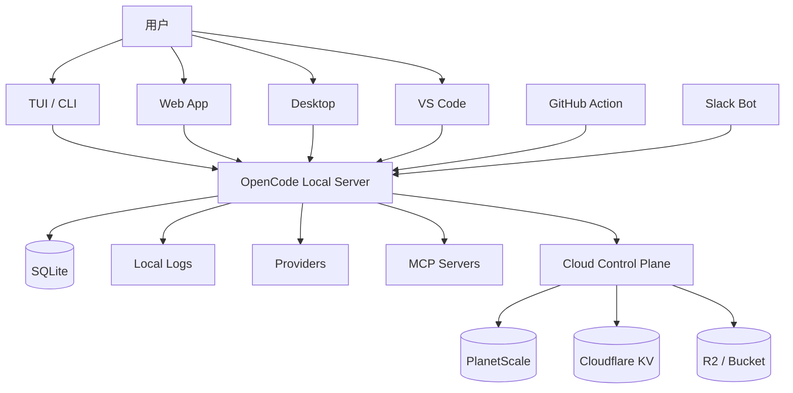
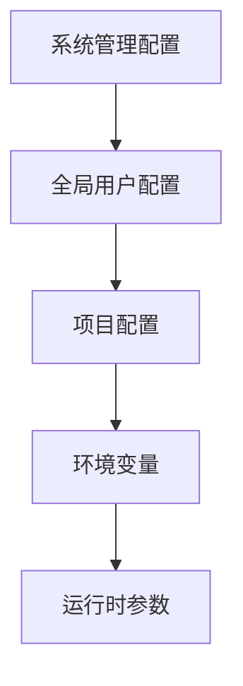
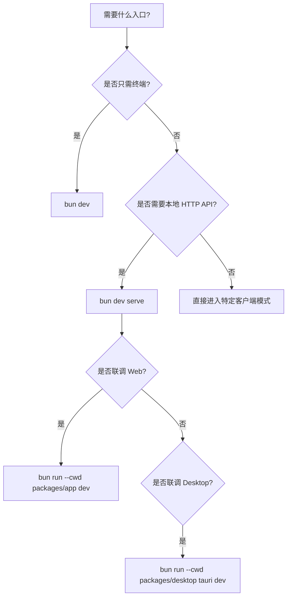
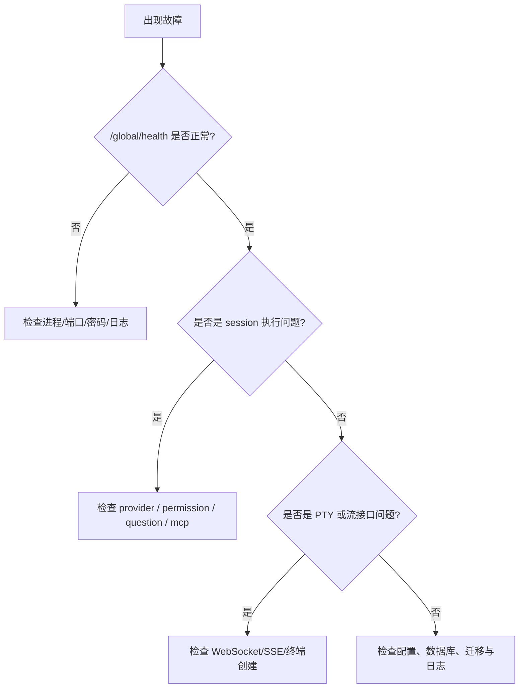

# OpenCode 部署与运维手册

> 文档定位：面向平台工程师、运维团队和内部部署维护者的可执行手册。
>
> 配套文档：
>
> - 架构白皮书：[`opencode-architecture-whitepaper-zh.md`](./opencode-architecture-whitepaper-zh.md)
> - OpenAPI 文档：[`opencode-openapi-3.1.json`](./opencode-openapi-3.1.json)
> - Apifox 导入说明：[`apifox-import-guide.md`](./apifox-import-guide.md)

| 元信息       | 内容                                     |
| ------------ | ---------------------------------------- |
| 文档版本     | `v1.0`                                   |
| 文档语言     | 中文                                     |
| 文档类型     | 部署与运维手册                           |
| 适配范围     | 当前仓库主干实现与本地/控制面部署形态    |
| 建议维护方式 | 每次启动、配置、存储、接口变更后同步更新 |

## 摘要

本手册的目标不是解释 OpenCode 的全部内部设计，而是帮助团队把它稳定地安装、配置、启动、验证、监控、备份和恢复。你可以把它视为一份偏运行层的 Runbook。

OpenCode 的运维重点集中在四件事：

- 正确理解本地执行模型
- 正确管理 provider 和 mcp 配置
- 正确备份 SQLite 与本地状态目录
- 正确识别 SSE、PTY、外部工具与权限流带来的运行差异

## 读者指引

建议按以下方式使用本手册：

1. 首次部署时，按“安装 -> 配置 -> 启动 -> 运行验证”的顺序执行。
2. 日常维护时，重点看“监控与可观测性”“升级”“安全运维要求”。
3. 出现故障时，直接跳到“故障排查”和附录中的检查表。
4. 如果你需要先理解系统全貌，再执行落地，请先阅读：[`opencode-architecture-whitepaper-zh.md`](./opencode-architecture-whitepaper-zh.md)

## 版本与适配说明

- 本文档基于当前仓库中的本地运行模式、桌面端、控制面基础设施和数据存储实现整理。
- 文中的命令、目录、日志路径和备份建议以当前仓库实现为准。
- 如果未来数据库路径、日志策略、Provider/MCP 配置模型或桌面端实现发生变化，应优先更新以下章节：
  - 配置
  - 启动
  - 监控与可观测性
  - 数据与备份
  - 故障排查

## 文档维护规范

- 当新增启动方式时，补“启动命令速览”和“启动决策图”。
- 当新增关键配置项时，补“关键配置项表”。
- 当数据库、日志或状态目录调整时，补“本地核心目录”“备份范围清单”。
- 当引入新的外部依赖平台时，补“环境准备对照表”“安全运维要求”。
- 当排障路径发生变化时，补“故障排查总流程”和“常见问题速查表”。

## 目录

- [1. 文档目标](#1-文档目标)
- [2. 部署模式概览](#2-部署模式概览)
- [3. 安装](#3-安装)
- [4. 配置](#4-配置)
- [5. 启动](#5-启动)
- [6. 运行验证](#6-运行验证)
- [7. 监控与可观测性](#7-监控与可观测性)
- [8. 数据与备份](#8-数据与备份)
- [9. 升级](#9-升级)
- [10. 安全运维要求](#10-安全运维要求)
- [11. 故障排查](#11-故障排查)
- [12. 测试与验证建议](#12-测试与验证建议)
- [13. 运维建议清单](#13-运维建议清单)
- [14. 结语](#14-结语)
- [附录 A. 常用命令速查表](#附录-a-常用命令速查表)
- [附录 B. 运维检查表](#附录-b-运维检查表)

## 部署拓扑示意



## 1. 文档目标

本文档面向需要安装、配置、启动、监控、备份和排障 OpenCode 的工程团队，整理出一套可执行的部署与运维指南。

适用对象：

- 本地开发环境维护者
- 平台工程师
- 企业内部部署团队
- 研发效能平台团队

本文档覆盖：

- 安装
- 配置
- 启动
- 监控
- 备份
- 故障排查

## 2. 部署模式概览

### 2.1 部署模式对照表

| 模式                | 适用场景          | 核心组件                                          | 是否推荐用于日常开发 |
| ------------------- | ----------------- | ------------------------------------------------- | -------------------- |
| CLI / TUI           | 本地单人开发      | `packages/opencode`                               | 是                   |
| Local API Server    | Web/桌面/扩展接入 | `packages/opencode/src/server`                    | 是                   |
| Web / Desktop 联调  | 前端和产品开发    | `packages/app` / `packages/desktop`               | 是                   |
| GitHub Action       | 仓库自动化        | `github/`                                         | 视需求               |
| Slack Bot           | 团队协作入口      | `packages/slack`                                  | 视需求               |
| Cloud Control Plane | 商业化/组织能力   | `infra/` `packages/console` `packages/enterprise` | 否                   |

OpenCode 当前主要有 5 种部署模式：

1. 本地 CLI / TUI 模式
2. 本地 API server 模式
3. 本地 Web / Desktop 联调模式
4. 自动化入口模式
   - GitHub Action
   - Slack Bot
5. 云端控制面 / 企业版部署模式

最常见的生产力使用方式仍然是：

- 本地运行 `opencode` 核心服务
- 由 TUI、Web、桌面端或 VS Code 接入本地服务

## 3. 安装

### 3.0 安装流程图


### 3.1 基础要求

仓库主要依赖：

- Bun
- Node 生态工具链
- Git

桌面端还需要：

- Rust toolchain
- Tauri 平台依赖

云端部署还需要：

- SST
- Cloudflare 账号与资源
- PlanetScale
- Stripe

### 3.2 安装依赖

在仓库根目录执行：

```bash
bun install
```

### 3.3 本地开发模式启动前检查

建议确认：

- Bun 版本可用
- Git 可用
- 当前项目目录可读写
- 模型 provider 所需环境变量已准备

### 3.4 构建 CLI

如果需要构建单文件 CLI 产物：

```bash
./packages/opencode/script/build.ts --single
```

### 3.5 生成 SDK

如果修改了 API 或 SDK，需要重新生成：

```bash
./script/generate.ts
./packages/sdk/js/script/build.ts
```

## 环境准备对照表

| 项目              | 本地开发 | 桌面端 | 云端控制面 |
| ----------------- | -------- | ------ | ---------- |
| Bun               | 必需     | 必需   | 必需       |
| Git               | 必需     | 必需   | 视场景     |
| Rust / Tauri 依赖 | 否       | 必需   | 否         |
| Cloudflare 凭据   | 否       | 否     | 必需       |
| PlanetScale 凭据  | 否       | 否     | 必需       |
| Stripe 凭据       | 否       | 否     | 视场景     |

## 4. 配置

### 4.0 配置来源顺序



### 4.1 配置层级

OpenCode 的配置存在多层来源：

- 系统管理配置
- 全局用户配置
- 项目配置
- 环境变量
- 运行期参数

管理配置目录：

- macOS: `/Library/Application Support/opencode`
- Windows: `C:\ProgramData\opencode`
- Linux: `/etc/opencode`

### 4.2 本地核心目录

默认 XDG 路径如下：

- 数据目录：`$XDG_DATA_HOME/opencode`
- 状态目录：`$XDG_STATE_HOME/opencode`
- 缓存目录：`$XDG_CACHE_HOME/opencode`

常见 Linux 默认值通常是：

- `~/.local/share/opencode`
- `~/.local/state/opencode`
- `~/.cache/opencode`

### 4.3 数据库配置

默认数据库：

- `~/.local/share/opencode/opencode.db`

覆盖方式：

- `OPENCODE_DB=:memory:` 使用内存数据库
- `OPENCODE_DB=<absolute-path>` 使用绝对路径数据库
- `OPENCODE_DB=<relative-path>` 使用数据目录下相对路径数据库

### 4.4 Server Mode 配置

如果作为本地 HTTP 服务运行，建议至少关注：

- `OPENCODE_SERVER_PASSWORD`
- `OPENCODE_SERVER_USERNAME`

说明：

- 未设置密码时，server 可无鉴权运行
- 已设置密码时，服务启用 HTTP Basic Auth

### 4.5 Provider 配置

Provider 主要由以下因素共同决定：

- 配置中的 `enabled_providers`
- 配置中的 `disabled_providers`
- 本地 auth 状态
- 环境变量中的 API key 或 OAuth 凭据

### 4.6 MCP 配置

MCP 支持两类：

1. `local`
2. `remote`

典型配置项：

- `type`
- `command` 或 `url`
- `environment`
- `headers`
- `enabled`
- `timeout`
- `oauth`

### 4.7 Permission 配置

Permission 的动作是：

- `ask`
- `allow`
- `deny`

典型做法：

- 对高风险操作使用 `ask`
- 对绝不允许的操作使用 `deny`
- 对明确可信路径使用 `allow`

### 4.8 桌面端配置

桌面端本质上会启动本地 sidecar 或本地 server，并读取自己的本地用户数据目录。

对于桌面部署，需要同时考虑：

- server URL
- 本地用户目录
- 更新器开关
- sidecar CLI 生命周期

## 关键配置项表

| 配置项                     | 作用              | 建议                     |
| -------------------------- | ----------------- | ------------------------ |
| `OPENCODE_DB`              | 指定数据库路径    | 生产排障时显式确认       |
| `OPENCODE_SERVER_USERNAME` | Basic Auth 用户名 | 一般保持 `opencode`      |
| `OPENCODE_SERVER_PASSWORD` | Basic Auth 密码   | 远程暴露必须设置         |
| `enabled_providers`        | 限定可用 provider | 企业环境建议显式声明     |
| `disabled_providers`       | 屏蔽 provider     | 用于风险控制             |
| `mcp.*`                    | MCP 服务配置      | 对高风险外部服务谨慎开启 |

## 5. 启动

### 5.0 启动决策图



### 5.1 启动 CLI / TUI

```bash
bun dev
```

指定目录：

```bash
bun dev .
bun dev /path/to/project
```

### 5.2 启动本地 API Server

```bash
bun dev serve
```

自定义端口：

```bash
bun dev serve --port 8080
```

### 5.3 启动 Web 联调

```bash
bun dev serve
bun run --cwd packages/app dev
```

### 5.4 启动 Tauri 桌面端

```bash
bun run --cwd packages/desktop tauri dev
```

构建桌面端：

```bash
bun run --cwd packages/desktop tauri build
```

### 5.5 启动 ACP 服务

```bash
opencode acp
```

指定目录：

```bash
opencode acp --cwd /path/to/project
```

启用提问工具：

```bash
OPENCODE_ENABLE_QUESTION_TOOL=1 opencode acp
```

### 5.6 GitHub Action 模式

准备工作：

1. 安装 GitHub App
2. 添加工作流 `.github/workflows/opencode.yml`
3. 配置模型和 API keys
4. 在评论区使用 `/oc` 或 `/opencode`

### 5.7 Slack Bot 模式

准备工作：

1. 创建 Slack App
2. 开启 Socket Mode
3. 配置 scopes
4. 设置 `.env`

核心变量：

- `SLACK_BOT_TOKEN`
- `SLACK_SIGNING_SECRET`
- `SLACK_APP_TOKEN`

## 启动命令速览

| 目标            | 命令                                               |
| --------------- | -------------------------------------------------- |
| CLI / TUI       | `bun dev`                                          |
| 指定目录运行    | `bun dev .`                                        |
| 本地 API Server | `bun dev serve`                                    |
| 指定端口        | `bun dev serve --port 8080`                        |
| Web 联调        | `bun dev serve` + `bun run --cwd packages/app dev` |
| Tauri 桌面联调  | `bun run --cwd packages/desktop tauri dev`         |
| Tauri 构建      | `bun run --cwd packages/desktop tauri build`       |
| ACP             | `opencode acp`                                     |

## 6. 运行验证

### 6.0 验证流程图

```mermaid
flowchart LR
  A[进程启动] --> B[/global/health]
  B --> C[/project]
  C --> D[/session]
  D --> E[/provider]
  E --> F[/mcp]
  F --> G[创建 session 并发送消息]
```

### 6.1 健康检查

最基础检查：

```bash
curl http://localhost:4096/global/health
```

如果启用了密码：

```bash
curl -u opencode:YOUR_PASSWORD http://localhost:4096/global/health
```

预期返回类似：

```json
{
  "healthy": true,
  "version": "x.y.z"
}
```

### 6.2 核心功能检查

建议至少验证：

- `/project`
- `/session`
- `/provider`
- `/config`
- `/mcp`

### 6.3 SSE 检查

可用浏览器或支持流式查看的客户端验证：

- `/event`
- `/global/event`
- `/global/sync-event`

### 6.4 PTY 检查

检查流程：

1. 创建 PTY
2. 获取 PTY ID
3. 连接 `/pty/{ptyID}/connect`
4. 验证终端输出是否实时返回

## 最小验收矩阵

| 检查项        | 接口或动作                  | 预期结果              |
| ------------- | --------------------------- | --------------------- |
| 健康检查      | `/global/health`            | 返回 `healthy: true`  |
| 项目枚举      | `/project`                  | 能返回项目列表        |
| 会话枚举      | `/session`                  | 能返回 session 列表   |
| Provider 状态 | `/provider`                 | 返回可用 provider     |
| MCP 状态      | `/mcp`                      | 返回状态映射          |
| 消息流转      | 创建 session 并发送 message | 能生成 assistant 输出 |

## 7. 监控与可观测性

这一章的重点不是“做大而全的监控平台”，而是告诉你 OpenCode 的关键观测点在哪里，哪些信号对排障最有价值。

## 监控重点表

| 维度     | 关注点               | 位置                     |
| -------- | -------------------- | ------------------------ |
| 健康     | 服务是否存活         | `/global/health`         |
| 请求     | method/path/duration | 本地结构化日志           |
| 流连接   | SSE heartbeat        | `/event` `/global/event` |
| 终端     | PTY 是否持续输出     | `/pty/{ptyID}/connect`   |
| 模型     | provider 是否可用    | `/provider`              |
| 外部工具 | MCP 状态是否异常     | `/mcp`                   |

### 7.1 本地日志位置

日志目录：

- `~/.local/share/opencode/log`

文件特点：

- 非 dev 模式使用时间戳日志文件
- dev 模式使用 `dev.log`

### 7.2 日志轮转策略

当前实现不是按天保留，而是按文件数量保留。

实际特点：

- 大致保留最近约 10 个时间戳日志文件
- `dev.log` 不参与自动清理
- 没有内置压缩归档
- 没有按大小分割

### 7.3 请求级可观测性

服务会记录：

- 请求 method/path
- 请求开始和结束
- duration

### 7.4 客户端日志上报

客户端可调用：

- `POST /log`

统一写入结构化日志。

### 7.5 SSE 保活

SSE 流每 10 秒发送 heartbeat，用于：

- 避免代理层断流
- 辅助判断连接健康度

### 7.6 云端可观测性

云端控制面已接入：

- Cloudflare logpush
- tail consumer
- Honeycomb

但日志保留周期仍由平台配置决定，不由仓库本身控制。

## 8. 数据与备份

对于 OpenCode，备份的关键不是只拷贝一个数据库文件，而是完整保留 data/config/state 目录及 SQLite WAL 相关文件。

## 备份范围清单

| 路径                                      | 内容         | 是否必须 |
| ----------------------------------------- | ------------ | -------- |
| `~/.local/share/opencode/opencode.db`     | 主数据库     | 是       |
| `~/.local/share/opencode/opencode.db-wal` | WAL          | 是       |
| `~/.local/share/opencode/opencode.db-shm` | SHM          | 是       |
| `~/.local/share/opencode/storage`         | 历史迁移数据 | 建议     |
| `~/.config/opencode`                      | 配置         | 是       |
| `~/.local/state/opencode`                 | 状态文件     | 建议     |
| `~/.local/share/opencode/log`             | 日志         | 可选     |

## 备份恢复流程图

```mermaid
flowchart TD
  A[停止 OpenCode 进程] --> B[备份 data/config/state 目录]
  B --> C[恢复目标机器目录]
  C --> D[检查权限]
  D --> E[启动服务]
  E --> F[/global/health 验证]
  F --> G[/project /session 验证]
```

### 8.1 本地需要备份的目录

建议备份：

- `~/.local/share/opencode`
- `~/.config/opencode`
- `~/.local/state/opencode`

尤其是：

- `opencode.db`
- `opencode.db-wal`
- `opencode.db-shm`
- `storage/` 历史迁移数据
- `log/` 可选保留

### 8.2 本地备份建议

最稳妥的方式是停机后整目录备份：

```bash
cp -a ~/.local/share/opencode /backup/opencode-data
cp -a ~/.config/opencode /backup/opencode-config
cp -a ~/.local/state/opencode /backup/opencode-state
```

### 8.3 在线备份注意事项

若不停机备份 SQLite，不能只拷贝主库文件，必须同时保留：

- `opencode.db`
- `opencode.db-wal`
- `opencode.db-shm`

否则可能丢失 WAL 中未 checkpoint 的事务。

### 8.4 恢复流程

恢复建议步骤：

1. 停止所有 OpenCode 进程
2. 恢复 data/config/state 目录
3. 校验文件权限
4. 启动服务
5. 访问 `/global/health`
6. 验证 `/project` 与 `/session`

### 8.5 云端备份

云端系统的备份需要分别依赖平台：

- PlanetScale
- Cloudflare KV
- Cloudflare Bucket/R2
- Secret 管理平台
- Stripe

当前仓库没有完整自动化灾备脚本，建议在平台侧单独建立：

- 数据库恢复预案
- KV 导出策略
- 对象存储版本化策略
- Secret 回填流程

## 9. 升级

升级前一定优先备份。对于本地状态驱动系统，这比自动升级本身更重要。

## 升级操作清单

| 步骤 | 动作                       |
| ---- | -------------------------- |
| 1    | 备份数据库和配置           |
| 2    | 记录当前版本               |
| 3    | 检查 provider / mcp 配置   |
| 4    | 执行升级                   |
| 5    | 运行健康检查               |
| 6    | 验证核心接口与最近 session |

### 9.1 本地升级

可通过全局升级接口：

- `POST /global/upgrade`

也可结合实际安装方式使用发行版本升级策略。

### 9.2 升级前检查

建议先做：

1. 备份数据库与配置
2. 记录当前版本
3. 检查 provider 与 mcp 配置
4. 检查是否存在旧版 JSON 数据待迁移

### 9.3 升级后检查

建议验证：

- `/global/health`
- `/config`
- `/provider`
- `/session`
- 最近会话消息能否正常读取
- PTY 是否可用
- MCP 是否仍可连接

## 10. 安全运维要求

再次强调：OpenCode 的权限系统不是沙箱。远程部署场景必须自行补足鉴权、网络边界和运行隔离。

## 安全控制建议表

| 场景       | 建议                                         |
| ---------- | -------------------------------------------- |
| 本地单机   | 可不启用密码，但仍建议限制暴露范围           |
| 局域网共享 | 启用 `OPENCODE_SERVER_PASSWORD` 并加反向代理 |
| 公网暴露   | 不建议直接暴露；必须额外加 ACL/VPN/网关      |
| 高风险仓库 | 使用 Docker 或 VM                            |
| 外部 MCP   | 视为不可信组件                               |

### 10.1 不要把 Permission 当作安全沙箱

Permission 只是交互式控制，不是 OS 级隔离。

### 10.2 远程暴露必须加固

建议至少做到：

1. 设置 `OPENCODE_SERVER_PASSWORD`
2. 放在反向代理后面
3. 加入 ACL/VPN/内网限制
4. 不直接暴露到不可信公网

### 10.3 高风险代码库建议使用隔离环境

建议把 OpenCode 放到：

- Docker
- VM
- 受限开发容器

### 10.4 MCP 风险控制

把所有外部 MCP server 视为不可信执行边界。

建议：

- 审核来源
- 控制连接范围
- 配置专用 token
- 限制高风险远程 MCP

### 10.5 Secret 管理

生产环境 secrets 不应写死在配置中，应使用：

- SST Secret
- CI Secret
- Secret 管理平台

## 11. 故障排查

建议排障时遵循一个原则：先看健康检查，再看日志，再看 provider/mcp/session/pty 的具体链路，不要一上来就删除数据或重装。

## 故障排查总流程



### 11.1 服务无法启动

检查项：

1. Bun 是否可用
2. 端口是否被占用
3. 数据目录是否可写
4. 配置文件是否损坏
5. 数据库路径是否有效
6. 日志目录是否可写

排查方式：

- 查看 `~/.local/share/opencode/log`
- 查看 `dev.log` 或最新时间戳日志

### 11.2 健康检查失败

若 `/global/health` 不通，依次检查：

1. 进程是否还在
2. 端口是否监听
3. 是否启用了 Basic Auth
4. 代理或 CORS 是否挡住请求

### 11.3 Web/桌面端无法连接本地服务

检查项：

1. server 是否启动
2. URL 是否正确
3. 密码是否匹配
4. 桌面端 sidecar 是否正常拉起
5. 本地防火墙或代理是否拦截

### 11.4 Session 无法运行

常见原因：

- provider 未认证
- 模型不可用
- permission 被拒绝
- mcp 工具加载失败
- session 状态仍处于 busy

排查步骤：

1. 看 `/provider`
2. 看 `/config/providers`
3. 看 `/permission`
4. 看 `/question`
5. 看日志中的 provider/mcp/session 相关错误

### 11.5 Provider 无法使用

检查项：

1. 是否被 `disabled_providers` 过滤
2. 是否在 `enabled_providers` 名单内
3. auth 是否存在
4. OAuth 是否完成
5. API key 是否有效
6. 模型是否受区域或额度限制

### 11.6 MCP 连接失败

本地 MCP：

1. 检查 `command` 是否能独立执行
2. 检查 PATH 和工作目录
3. 查看 MCP stderr 日志

远程 MCP：

1. 检查 URL 是否可访问
2. 检查 headers
3. 检查 OAuth 是否需要 clientId
4. 检查 timeout 是否太小
5. 查看 MCP 状态：
   - `failed`
   - `needs_auth`
   - `needs_client_registration`

### 11.7 PTY 不工作

检查项：

1. shell 是否存在
2. PTY 创建是否成功
3. WebSocket 是否升级成功
4. `cursor` 参数是否合法
5. 是否被系统终端或权限限制拦截

### 11.8 数据异常或迁移失败

检查项：

1. SQLite 主库/WAL 文件是否完整
2. 历史 `storage/` 目录是否存在
3. 数据目录权限是否正确
4. 版本升级后 migration 是否完整执行

### 11.9 日志过大

原因通常是：

- 长期 dev 模式运行
- `dev.log` 没有轮转

建议：

1. 定期归档或清理 `dev.log`
2. 长期服务运行尽量用非 dev 模式

## 常见问题速查表

| 问题            | 首先检查                                  |
| --------------- | ----------------------------------------- |
| 服务起不来      | 端口、权限、日志、数据库路径              |
| 健康检查失败    | 进程、鉴权、监听地址                      |
| Web/桌面连不上  | server URL、密码、sidecar                 |
| session 不执行  | provider、permission、question、busy 状态 |
| provider 不可用 | auth、enabled/disabled 配置、额度限制     |
| MCP 失败        | URL/command、OAuth、timeout、stderr       |
| PTY 失效        | shell、WebSocket、cursor、系统权限        |
| 数据异常        | SQLite 主库/WAL、旧存储迁移、权限         |

## 12. 测试与验证建议

### 12.1 不要在仓库根目录直接跑测试

仓库根测试脚本会故意失败作为 guard。

### 12.2 类型检查

应在 package 目录内执行，例如：

```bash
bun run --cwd packages/opencode typecheck
```

### 12.3 变更后的最小回归检查

建议最少做以下验证：

1. `/global/health`
2. `/project`
3. `/session`
4. 创建新 session
5. 发送一条 message
6. 查看 message 列表
7. Provider 状态检查
8. MCP 状态检查

## 13. 运维建议清单

推荐在正式环境执行以下清单：

1. 设置 `OPENCODE_SERVER_PASSWORD`
2. 为高风险仓库使用 Docker 或 VM
3. 备份 XDG data/config/state 目录
4. 接入外部日志平台
5. 定期审查 Provider 与 MCP 配置
6. 限制不必要的远程暴露
7. 把 SSE / PTY / MCP 视为高关注接口
8. 版本升级前先做数据库备份

## 附录 A. 常用命令速查表

| 用途            | 命令                                               |
| --------------- | -------------------------------------------------- |
| 安装依赖        | `bun install`                                      |
| 启动 TUI        | `bun dev`                                          |
| 启动 API Server | `bun dev serve`                                    |
| 启动 Web 联调   | `bun dev serve` + `bun run --cwd packages/app dev` |
| 启动桌面联调    | `bun run --cwd packages/desktop tauri dev`         |
| 构建桌面端      | `bun run --cwd packages/desktop tauri build`       |
| 构建单文件 CLI  | `./packages/opencode/script/build.ts --single`     |
| 生成 SDK        | `./packages/sdk/js/script/build.ts`                |
| 健康检查        | `curl http://localhost:4096/global/health`         |

## 附录 B. 运维检查表

### 日常检查

- `/global/health` 正常
- 本地日志无持续错误
- provider 列表可用
- mcp 状态无异常堆积
- 最近 session 可正常读写

### 升级前检查

- 已备份 data/config/state
- 已确认当前版本
- 已检查 provider 与 mcp 配置
- 已通知使用方升级窗口

### 故障恢复后检查

- 健康检查正常
- project 列表正常
- session 列表正常
- 最近消息完整
- PTY 与流式接口正常

## 14. 结语

OpenCode 的部署与运维难点，不在于把一个服务跑起来，而在于正确理解它的本地执行模型、事件同步模型和非沙箱安全边界。

只要围绕以下四点建立运维规范，系统一般可以稳定运行：

1. 先备份，再升级
2. 先隔离，再远程暴露
3. 先验证 provider/mcp，再排 session
4. 先看日志，再做恢复或重置

如果你希望把 OpenCode 纳入正式平台治理体系，建议把本手册和白皮书一起作为交付基线文档维护。
